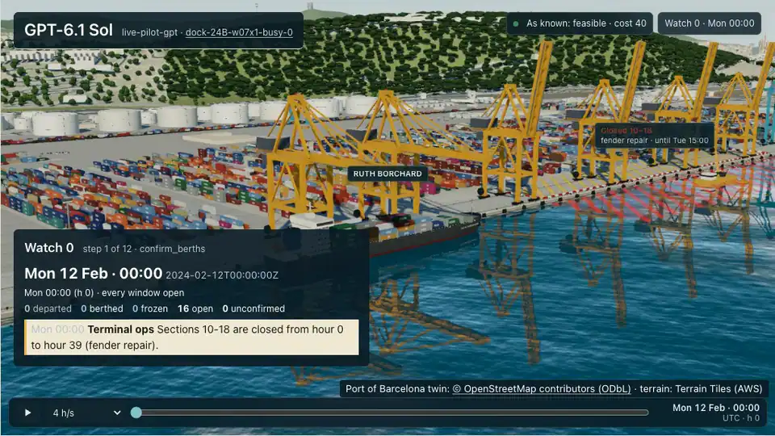
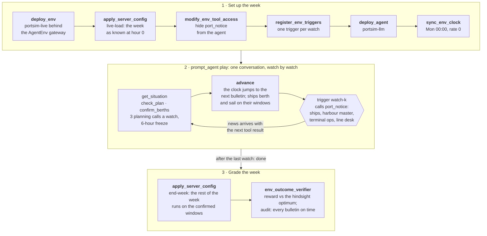
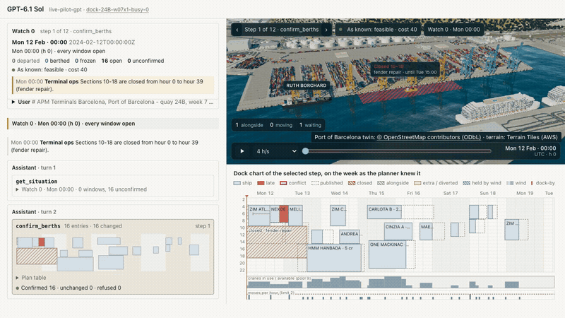

# PortSimEnv for AgentEnv

[](https://github.com/earakely-scale/agentenv-portsim-plugin/actions/workflows/ci.yml)
[](NOTICE)
[](https://www.agentenvframework.com)

<p align="center">
  <a href="https://github.com/earakely-scale/agentenv-portsim-plugin/releases/tag/replays-2026-10-07"></a>
</p>
<p align="center"><sub><b>The live port:</b> GPT-6.1 Sol runs a week at APM Terminals Barcelona as it unfolds on AgentEnv's virtual clock. A closure, an emergency, late ships, a crane outage, a gale and bunched arrivals come in as bulletins; it re-plans each watch and ends at the hindsight optimum (reward 1.0). Replayed on PortSimEnv's 3D viewer; <a href="https://github.com/earakely-scale/agentenv-portsim-plugin/releases/tag/replays-2026-10-07">full films</a>. Twin © OpenStreetMap contributors (ODbL).</sub></p>

<details open>
<summary><b>How a live task is built</b>: the task's steps, and the watch loop inside <code>play</code> (details in <a href="#the-live-port">The live port</a>)</summary>



</details>

An agent runs one container quay at the Port of Barcelona for a week of 2024 that has just gone wrong: late and
bunched ships, closed quay sections, crane breakdowns, gales, emergencies. It decides when, where along the quay and
with how many cranes every ship docks, and the week is graded deterministically against a plan CP-SAT proved optimal.
The ships and their calls, the quays' crane fleets and the port's berth and wind rules are real; the workloads and the
disruptions are simulated.

This repository is an environment plugin for the [AgentEnv Framework](https://www.agentenvframework.com), Scale AI's
open-source framework for building RL environments. It is built on **PortSimEnv**, Adithya S Kolavi's environment in
[FineEnvs](https://github.com/adithya-s-k/FineEnvs), called *upstream* below: the quay model, the task packs, the
grader and the 3D viewer come from it, and a week planned in one go plays here exactly as it does there. Read about it
in the article [Simulation RL Environments, part 1](https://huggingface.co/spaces/FineEnvs/simulation-rl-environments),
or play an episode by hand in the [PortSimEnv Space](https://huggingface.co/spaces/FineEnvs/PortSimEnv). The live
week is new here.

**Contents:** [What's in it](#whats-in-it) · [Run it yourself](#run-it-yourself) · [Tasks](#tasks) ·
[Play a model](#play-a-model) · [The environment](#the-environment) · [Grading](#grading) ·
[The live port](#the-live-port) · [Watch a run](#watch-a-run) ·
[Built on the AgentEnv Framework](#built-on-the-agentenv-framework) ·
[Layout](#repository-layout) · [Development](#development) · [Licence and credits](#licence-and-credits)

## What's in it

- **Two environments, in one image.**
  - `portsim` plans a week in one go: the agent reads the situation, checks drafts (10 checks) and submits one plan,
    within 24 tool calls ([The environment](#the-environment)).
  - `portsim-live` plays the same week as it unfolds, on AgentEnv's gateway. A virtual clock runs the week watch by
    watch, the ships, the harbour master, terminal ops and the line desk send their news through triggers, and
    windows about to start are frozen. The agent confirms berths as it goes ([The live port](#the-live-port)).
- **1,100 weeks to play.** They come from the port's 2024 container calls at two quays, 24B (APM Terminals
  Barcelona) and 36A (Terminal Catalunya, BEST), in four tiers from standard to extreme: 50 eval weeks and 1,050
  train weeks, with no week in both. 15 of the eval weeks are live weeks ([Tasks](#tasks)).
- **A deterministic grade, with no judge.** A valid plan scores 0.2 + 0.8·e^(−gap/0.5) against the optimum, so the
  optimum scores 1.0. A plan that breaks a rule scores under 0.2, and no plan scores 0. A live week is graded on the
  windows the agent confirmed, against the week as it really happened ([Grading](#grading)).
- **An agent.** `portsim-llm` plays a week with a model through agent-env's endpoint: the Hugging Face router for
  open models, or a LiteLLM proxy ([Play a model](#play-a-model)).
- **Commands.**
  - `agent-env portsim setup` builds the images and registers the envs and the agent.
  - `tasks generate`, `sweep run` and `sweep report` play models over the weeks under a spend cap.
  - `view` and `record` replay runs on a 3D twin of the quay and film them ([Watch a run](#watch-a-run)).
- **Results.** GPT-6.1 Sol and Claude Sonnet 5.5 on ten weeks planned in one go
  ([the comparison with upstream's eval](#the-comparison-with-the-published-eval)) and on all 15 live weeks
  ([the first live results](#the-first-live-results)).

## Run it yourself

You need [Docker](https://docs.docker.com/get-docker/), running and usable without `sudo`, with its buildx plugin,
[uv](https://docs.astral.sh/uv/) and git. No model key: the tasks in the bundle call no model.

```bash
uv tool install agentenv-framework \
    --with "agentenv-portsim @ git+https://github.com/earakely-scale/agentenv-portsim-plugin"
agent-env portsim setup              # build the env image for this machine; register the envs "portsim" and "portsim-live"
agent-env run portsim --task smoke   # load a task, submit its optimal plan, grade it
```

The run prints `tasks/smoke.json v1: passed` with the score (1), the time and the instance id; the run and its grade
are stored under `~/.local/state/agent-env`. `setup` has Docker build the images from the GitHub commit the plugin was
installed from, so it needs no clone.

agent-env reads `.agentenv/config.toml` from the directory it runs in or one above it. Without one, it runs on its
local defaults: stores under `~/.local/state/agent-env/`, images in a registry at `localhost:5000` that it starts on
first push, and the env as a container on this machine's Docker.
[`.agentenv/config.example.toml`](.agentenv/config.example.toml) describes that profile and the `modal_vm` one.

To change the plugin, work from a clone; `setup` then builds the checkout:

```bash
git clone https://github.com/earakely-scale/agentenv-portsim-plugin
uv tool install agentenv-framework --with-editable ./agentenv-portsim-plugin
cd agentenv-portsim-plugin && agent-env portsim setup
```

`setup` builds for the Docker host's own platform (`linux/arm64` on Apple Silicon). For Modal, put the `modal_vm`
profile in `.agentenv/config.toml`, set its `repository_prefix` to your own GHCR namespace, and run
`agent-env portsim setup --platform linux/amd64`, which pushes the image to `ghcr.io/<namespace>/agentenv-portsim-env`.
In an existing agent-env install, `agent-env plugin add ./agentenv-portsim-plugin` adds a clone of the plugin.

<details>
<summary>Troubleshooting</summary>

- **`agent-env: command not found`:** uv installed it in a directory that isn't on your PATH yet; run
  `uv tool update-shell` and open a new terminal.
- **A step fails because something holds port 5000:** agent-env keeps its images in a local registry on
  `127.0.0.1:5000`. On macOS, AirPlay Receiver often holds that port; turn it off in System Settings.
- **The run says there is no env `portsim` or `portsim-live`:** run `agent-env portsim setup` first, with the same config.
- **A model run fails with `provider_refused`:** the model endpoint refused the key or the account (401, 402 or 403).
  On the Hugging Face router, 402 means the account has no Inference Providers credits: add some, or bill an
  organization with `--hf-bill-to`.
</details>

## Tasks

The bundle `portsim` holds three wiring tasks. Each deploys the env, loads a task with `urn:portsim:load-task/v1`
and is graded by `portsim-verifier`:

| Task | What it does | Score |
|---|---|---|
| `smoke` | submits the task's optimal plan through `urn:portsim:submit-plan/v1` | 1, so it prints `passed` |
| `wiring-infeasible` | submits a plan that breaks the rules | at most 0.2 |
| `wiring-nosubmit` | submits nothing | 0 |

```bash
agent-env run portsim --task smoke --task wiring-infeasible --task wiring-nosubmit
```

The env holds both of upstream's dock-v1 packs, built from the port's 2024 container calls at quays 24B (APM
Terminals Barcelona) and 36A (Terminal Catalunya, BEST):

| Pack | Tasks | Tiers | Ships |
|---|---:|---|---|
| dock-v1-eval | 50 | standard 9, busy 15, storm 13, extreme 13 | 14 to 59 |
| dock-v1-train | 1,050 | standard 266, busy 260, storm 262, extreme 262 | 12 to 90 |

Ids read `dock-<quay>-w<week>x<weeks>-<tier>-<seed>`, e.g. `dock-24B-w07x1-busy-0`. No week appears in both packs.
To put a model on them, see [Play a model](#play-a-model).

## Play a model

`portsim-llm` (`agents/portsim-llm/agent.py`) is upstream's harness loop as an A2A agent. It keeps upstream's system
prompt and opening message, its nudges, notes and limits (12 turns, 32,000 output tokens a turn) and the episode
record upstream publishes, and it calls each model on the API upstream used for its provider, through agent-env's
model endpoint:

| Model id | API |
|---|---|
| `anthropic/...` | Messages, streamed |
| `openai/...` | Responses, streamed, with encrypted reasoning, effort `medium` and summary `auto` |
| any other | chat completions, streamed |

Name the endpoint in `.agentenv/config.toml`, or set `LITELLM_BASE_URL` and `LITELLM_API_KEY`. The open models
upstream evaluated go through the [Hugging Face router](https://huggingface.co/docs/inference-providers), as upstream
runs them, with a Hugging Face token that can make calls to Inference Providers on an account with credits:

```toml
[model]
base_url = "https://router.huggingface.co/v1"
api_key  = "env:HF_TOKEN"
```

Its models here are `Qwen/Qwen3.8-2.4T-A95B:together`, `Qwen/Qwen3.8-27B:ovhcloud`, `zai-org/GLM-5.3-Flash:baseten`
and `zai-org/GLM-5.3:together`. To bill an organization instead of the token's own account, pass `--hf-bill-to <org>`
to `tasks generate` or `sweep run`; the agent sends it as `X-HF-Bill-To`. The closed models go through a
[LiteLLM](https://docs.litellm.ai/) proxy:

```toml
[model]
base_url = "https://your-litellm-proxy"
api_key  = "secret:PORTSIM_MODEL_KEY"   # read through [stores.secret]; the local store takes it from the env var
```

Then build both images, write the eval tasks and play one:

```bash
agent-env portsim setup --agent                        # the env and portsim-llm, for this machine
agent-env portsim tasks generate --pack dock-v1-eval   # 50 tasks in results/bundles/dock-v1-eval
agent-env run results/bundles/dock-v1-eval --task dock-24B-w06x1-busy-0 --model zai-org/GLM-5.3-Flash:baseten
```

Each task deploys the env, loads its PortSim task, deploys `portsim-llm`, plays one episode and grades the plan with
`portsim-verifier`. A task names no model; `--model` picks it.

What differs from upstream's harness:

- **The env** is reached over MCP. MCP has no done flag, so the episode ends when `submit_plan` reports
  `"submitted": true` or after the 24th call.
- **One endpoint.** Upstream's chains of fallback providers are gone; every model goes through the endpoint agent-env
  is configured with.
- **Cost.** Each turn's token usage is priced from a table pinned in the agent, which holds
  `anthropic/claude-sonnet-5-5`, `openai/gpt-6.1-sol`, `fireworks_ai/glm-5p3-flash` and the four open models on the
  Hugging Face router; any other model fails before its first request. A request whose usage never arrives (it failed,
  or the harness cut its stream) is charged the most it could have cost, except one the provider refused (401, 402 or
  403: the key or the account), which costs nothing and ends the run as `provider_refused`. The episode stops before a
  request that could take its spend past `PORTSIM_MAX_COST_USD` ($5 in the generated tasks).
- **Failures.** A model error after the SDK's retries, an env error, a turn that would start after the task's two
  hours, or the cost cap fails the run as an infrastructure error, with the episode so far, instead of scoring it.

A sweep plays models over tasks and reps under a spend cap, and reports them against the published eval:

```bash
agent-env portsim sweep run --name pilot --models anthropic/claude-sonnet-5-5,openai/gpt-6.1-sol --tasks g2 \
    --cap-usd 20
agent-env portsim sweep report pilot   # results/parity.md
```

- Each attempt is its own `agent-env run` process. Its log, its row in `results.jsonl` and the agent's transcript go
  to `results/runs/<name>/`.
- `--tasks` takes `all`, `g2` or task ids; `g2` is the ten weeks of
  [the comparison](#the-comparison-with-the-published-eval).
- An attempt starts only if the spend so far plus the episode cap (`--episode-cap-usd`, default $5) of every attempt
  running, the new one included, stays within `--cap-usd`. An attempt whose spend isn't known counts at its cap.
- A failed attempt is retried up to twice; an episode stopped at its cost cap, or refused by the provider, is not.
  Running the same sweep again resumes it. Ctrl-C, or an error in the sweep itself, tears the running attempts down
  and records them.
- `report` compares each model with its episodes in the published dock-eval50 run (`data/published/`) on the same
  tasks: means with upstream's bootstrap CIs, the difference per task, per tier and week by week, with submitted,
  feasible and optimal counts, turns, tokens and cost.

### The comparison with the published eval

The comparison plays `portsim-llm` with the published closed models, `openai/gpt-6.1-sol` and
`anthropic/claude-sonnet-5-5`, on ten eval weeks, and sets each week's reward next to the published one. It reports
the differences without a pass or fail line. The first run, sweep `g2` on Modal VMs, is in
[`results/parity.md`](results/parity.md); it cost $5.19 for 20 episodes:

| Model | Ours, mean of 10 weeks | Published, same 10 weeks | Weeks within ±0.05 | Tokens in/out per episode, ours / published |
|---|---:|---:|---:|---|
| GPT-6.1 Sol | 0.907 | 0.872 | 8 of 10 | 30.3k/6.7k / 29.4k/6.6k |
| Claude Sonnet 5.5 | 0.778 | 0.839 | 7 of 10 | 48.1k/26.2k / 107.2k/30.4k |

Each week is one episode on each side, so a single week can differ by a lot: GPT-6.1 Sol scored 1.0 on
`dock-36A-w35x2-extreme-0` where the published run has 0.700, and on the 56-ship storm week Sonnet 5.5 spent both of
its turns' 32k output tokens without calling a tool and ended with 0 (the published episode played 8 turns and scored
0.379), which also accounts for most of the gap in Sonnet's input tokens. Per turn, input and output tokens track the
published episodes.

The ten weeks (`--tasks g2`) were fixed from the pack alone, before any model played them:

1. The tiers share the ten slots in proportion to their size, by largest remainder (ties in the order standard, busy,
   storm, extreme): standard 2, busy 3, storm 3, extreme 2.
2. A tier of N tasks, sorted by (ships, task id), gives its n weeks at positions ⌊(2i+1)·N/(2n)⌋ for i = 0…n−1: the
   middle task of each of n equal slices of that order.

| Tier | Weeks (ships) |
|---|---|
| standard | `dock-36A-w35x1-standard-0` (19), `dock-36A-w17x1-standard-0` (29) |
| busy | `dock-24B-w06x1-busy-0` (17), `dock-36A-w05x1-busy-0` (27), `dock-36A-w05x2-busy-0` (51) |
| storm | `dock-24B-w35x2-storm-0` (24), `dock-24B-w06x2-storm-0` (32), `dock-36A-w15x2-storm-0` (56) |
| extreme | `dock-24B-w35x2-extreme-1` (25), `dock-36A-w35x2-extreme-0` (39) |

Both quays are in it: four weeks at 24B and six at 36A. `tests/sweep/` recomputes the list from the pack.

## The environment

`PortSimEnv` (`src/agentenv_portsim/server.py`) serves upstream's three tools:

| Tool | What it does |
|---|---|
| `get_situation()` | The quay, notices, ships already alongside, closed sections, cranes, wind windows and the table of ships to berth, as Markdown. It still answers after the episode ends |
| `check_plan(plan)` | Rule violations, departure, delay and cost per ship, and the plan's cost, as JSON with `checks_left`. 10 an episode; it doesn't grade the plan |
| `submit_plan(plan)` | Grades the plan and ends the episode: `submitted`, `feasible` and `reward`, then the cost, delay cost and moves of a valid plan, or the violations of one that isn't |

A plan has one entry per ship, `[{"ship": 0, "berth_hour": 36, "section": 22, "cranes": 3}, ...]`, where `cranes`
defaults to the ship's planned cranes; it can also be sent as a string. Every tool call counts toward the limit of
24, failed ones included, and a 24th call that isn't a submit ends the episode with reward 0. Once the episode is
over, `check_plan` and `submit_plan` return an error.

For the harness, not the agent:

| Surface | What it does |
|---|---|
| `urn:portsim:load-task/v1` `{"task_id": ...}` | Loads the task and resets the counters; an unknown id is an error |
| `urn:portsim:submit-plan/v1` `{"plan": ...}` | Does what `submit_plan` does; the wiring tasks use it |
| `data/reset` | Clears the episode |
| `data/get` | `task_id`, `checks_used`, `calls_used`, `done`, `end_reason`, `plan`, `grade` and `reward`; never the task's reference plans (the grade, there only after a submit, includes the optimal and naive costs) |

## Grading

The env grades a submitted plan once, with `berth_core`'s reward v3, which every dock-v1 task uses:

- A plan that breaks any rule, or has entries the checker can't use, scores 0.2 times the fraction of clean ships,
  so less than 0.2.
- A valid plan scores 0.2 + 0.8·e^(−g/0.5), with g = max(0, cost − optimum) / (max(0, optimum − floor) + 100). The
  optimum is the cost of the CP-SAT plan and the floor the cost no plan can avoid, so the optimum scores 1.0.
- An episode that ends without a submit scores 0.

Rewards are rounded to six decimals, and the same plan always gets the same reward. `portsim-verifier` reads
`data/get` and reports one row whose score is the reward, so with `weighted_average` the task's score is the reward
itself. If the env can't answer `data/get`, the verifier raises and the run fails rather than scoring 0.
`agent-env run` prints `passed` only for a score of 1; any other reward prints `scored below 1` with the score.

## The live port

The live port is v2: the same quay and the same weeks, played as they unfold. The env `portsim-live`
(`src/agentenv_portsim/live.py`) starts a one-week task at Monday 00:00 with only what the port knows then. The rest
reaches the agent during the week: ships report delays and unscheduled calls, the harbour master issues gale warnings
and emergencies, terminal ops announce crane outages, and the line desk flags priority cargo. The agent confirms
berth windows as it goes. The week is graded once, on the windows it confirmed, against the week as it really
happened. The live port runs on the AgentEnv gateway: the gateway's virtual clock is the port's clock, its triggers
deliver the news, and a per-role rule hides the tool they deliver it through. The `portsim` env and its tasks are
unchanged.

### How a live week runs

- **Watches.** A week is played in watches: watch 0 at hour 0, then one per news bulletin, 2 to 9 watches in all.
  At watch 0 the agent sees the week as known at hour 0: the published arrivals, the closures, which are planned
  works, and no unscheduled calls.
- **`advance`.** Time passes only when the agent calls `advance`. The port moves to the next bulletin, ships berth
  and sail on their confirmed windows, and the bulletin's messages arrive with the next tool result. No time passes
  while the model thinks.
- **The freeze.** From watch 1 on, a window that starts before the freeze line, 6 hours after the current hour, is
  frozen: the harbour master refuses to change it, and new or changed windows must start at or after the line.
- **Planning calls.** `check_plan` and `confirm_berths` share 3 calls a watch.
- **The end.** After the last watch, `advance` returns `done` with the week's reward. An agent that stops early is
  graded on what it confirmed: the task's next step runs the remaining watches with no changes, then grades the week.

The example week `dock-24B-w07x1-busy-0` has 17 ships and a hindsight optimum of 226. The agent gets the task's own
notices, verbatim; in short:

| Watch | Time (hour) | From | News |
|---:|---|---|---|
| 0 | Mon 00:00 (0) | Terminal ops | Sections 10-18 closed from hour 0 to 39 |
| 1 | Tue 06:00 (30) | MAERSK NUBA | Unscheduled call: arrives at hour 58, asks to sail by 74 |
| 2 | Tue 18:00 (42) | Harbour master | Emergency: ZIM CHINA must dock by hour 64; each hour later costs 60 |
| 3 | Wed 06:00 (54) | CARLOTA B | Delayed: arrives at hour 93 (planned slot 78) |
| 4 | Thu 12:00 (84) | MAERSK NARMADA; Terminal ops | Delayed: arrives at hour 129 (slot 112); 2 of 9 cranes out from hour 108 to 155 |
| 5 | Thu 18:00 (90) | Harbour master | Gale: no ship of 300 m or more berths or leaves from hour 115 to 144, and no ship at all from 117 to 126 |
| 6 | Sat 00:00 (120) | Ship agents | Ships 12, 13 and 14 now arrive together between hours 156 and 168 |

Each kind of news is revealed a fixed time before the hour it is about (`src/agentenv_portsim/schedule.py`):

| News | Revealed |
|---|---|
| Closure | at hour 0 |
| Late ship, bunched ships | 24 hours before the original arrival |
| Unscheduled call, priority cargo | 24 hours before the arrival |
| Emergency | 12 hours before the arrival |
| Crane outage, gale | 24 hours before it starts |

Reveal times are floored at hour 0 and rounded down to a 6-hour bulletin. A ship's priority or emergency notice
never comes before its own delay or call. On every one-week task, each notice after hour 0 comes at least 12 hours
before the hour it is about, more than the 6-hour freeze. So a ship's own news never concerns a frozen window; an
outage or a gale still can, and the [excuses](#the-live-grade) cover that.

### The live env

`PortSimLiveEnv` serves four tools to the agent. Every result is one JSON object that ends with the messages not yet
read. A plan is a list of windows, `[{"ship": 7, "berth_hour": 95, "section": 4, "cranes": 2}, ...]`; ships left out
keep their confirmed windows.

| Tool | What it does |
|---|---|
| `get_situation()` | The watch and its time, the week as known now in upstream's Markdown, the confirmed windows (departed, berthed, frozen or open), the ships without a window, and the planning calls left. It still answers after the week ends |
| `check_plan(plan)` | Checks the windows merged over the confirmed ones, on the week as known now, and confirms nothing: the ships with a problem or a cost, the plan's cost, and the entries `confirm_berths` would refuse. A problem or cost that news brought to a frozen window is listed as excused and not counted |
| `confirm_berths(plan)` | Sets or changes the windows it lists. Each refusal carries the harbour master's reason |
| `advance()` | Ends the watch and returns the new watch, its hour, the ships berthed and departed, the freeze line and the ships without a window. After the last watch it returns `done` with `feasible`, `cost` and `reward` |

Once the clock is armed, the gateway also offers the agent its own `get_time`. Those calls never reach the env, so
the env's `calls_used` leaves them out.

For the harness, not the agent:

| Surface | What it does |
|---|---|
| `urn:portsim:live-load/v1` `{"task_id": ...}` | Starts the week. One-week tasks only, and one week per deployed env |
| `port_notice(event_id, name, text)` | Delivers one notice: the env applies the news and queues the message. The triggers call it; it is hidden from the agent's role |
| `urn:agentenv:clock/v1` `sync_time` | Takes the gateway clock's URL. From then on, each `advance` sets the clock to the next bulletin |
| `urn:portsim:end-week/v1` | Runs the watches the agent didn't reach, with no changes, then grades and audits the week |
| `data/reset` | Clears the week |
| `data/get` | The plan, the notice log, the frozen windows of each watch, refusals, excused problems and cost, the audit, the grade and the reward. Never the task's reference plans |

The bundle `portsim-live` holds two tasks: `week` plays `dock-24B-w07x1-busy-0` with `portsim-llm`, and
`wiring-noplay` runs the same steps without `deploy_agent` and `prompt_agent`. The steps of `week`, as of every live
task:

```
deploy_env              portsim-live, on the gateway
apply_server_config     urn:portsim:live-load/v1 {task_id}
modify_env_tool_access  disable port_notice for the role default
register_env_triggers   watch-1 ... watch-N
deploy_agent            portsim-llm
sync_env_clock          the week's start, rate 0 (stopped)
prompt_agent            the live rules and the watch-0 briefing, 5 turns a watch plus 2
apply_server_config     urn:portsim:end-week/v1
env_outcome_verifier    portsim-live-verifier
```

The trigger `watch-k` fires when `advance` returns `"watch": k`. It calls `port_notice` once for each of the watch's
notices, in order, and its barrier holds the agent's next call until they are applied. That is why the messages come
with the next result, and why the rules tell the agent to call `advance` and `get_situation` in one turn.

**The clock.** The env moves the gateway's clock itself. `sync_env_clock` arms the clock at the week's start with rate
0, and the gateway gives the env its clock URL through `urn:agentenv:clock/v1`. At each `advance`, the env calls the
gateway's `PUT /clock/set-time` with the next bulletin's time, again at rate 0. It finds that route by replacing `time`
with `set-time` at the end of the clock URL. So `get_time`, the trajectory's timestamps and the trigger log all show
the watch's time, and they hold still between watches. The gateway hands a server the clock URL to read the clock;
setting the clock from the env is this env's own use of the gateway's route, which takes no credentials.

### The live grade

- **The executed week.** The confirmed windows are checked against the true week and scored with `berth_core`'s
  reward v3, against the hindsight optimum and the floor, as in v1. An infeasible week scores below 0.2, and the
  hindsight optimum scores 1.0.
- **Excuses.** At each notice, the env checks the frozen windows on their own, before and after the news. A rule
  break or a cost that only the news added to a frozen window is not charged, and `check_plan` lists it as excused.
  For example, in the week above CARLOTA B is confirmed at hour 95 and frozen when the gale is announced at hour 90.
  It then has to wait alongside for the gale to pass. That adds 20 to the cost, which is excused, so the week still
  scores 1.0 (0.81 if the 20 were charged).
- **The audit.** A week is valid when:
  - every watch reached got exactly its scheduled notices, in order, before the agent's next call;
  - every notice after hour 0 came at least 6 hours ahead;
  - a finished week revealed each notice once.

  For a valid week, `portsim-live-verifier` scores the run with the week's reward and adds an audit row with weight 0.
  For a week that never finished or failed the audit, it raises, so the run is not scored.

### The references and the live weeks

`data/live/references.jsonl` plays each of the 18 one-week dock-v1-eval weeks two ways. Both go through the same week
model and grader as the env:

- **Rolling.** CP-SAT re-plans the week as known at every watch, with the frozen windows pinned and every other ship
  at or after the freeze line.
- **Naive.** The policy keeps each window that still fits. It moves the rest to the earliest legal hour at or after
  the freeze line, on the nearest section, with the same cranes.

A week is a live week when the rolling re-planner reaches the hindsight optimum under at least 3 of 4 solver
configurations: 1 or 8 workers, each with or without an earliest-finish tie-break. That way, 1.0 is reachable on what
the agent could know. 15 of the 18 weeks qualify:

| Tier | Live weeks (ships, watches) |
|---|---|
| standard | `dock-24B-w06x1-standard-0` (16, 4), `dock-24B-w37x1-standard-0` (15, 4), `dock-36A-w06x1-standard-0` (24, 3), `dock-36A-w10x1-standard-0` (32, 2), `dock-36A-w15x1-standard-0` (30, 4), `dock-36A-w35x1-standard-0` (19, 5), `dock-36A-w37x1-standard-0` (22, 5) |
| busy | `dock-24B-w06x1-busy-0` (17, 4), `dock-24B-w07x1-busy-0` (17, 7), `dock-24B-w16x1-busy-0` (16, 9), `dock-24B-w35x1-busy-0` (14, 8), `dock-36A-w05x1-busy-0` (27, 5), `dock-36A-w06x1-busy-0` (25, 6), `dock-36A-w17x1-busy-0` (28, 5), `dock-36A-w37x1-busy-0` (23, 7) |

On these 15 weeks the rolling re-planner scores 1.0 and the naive policy 0.2025 on average. Three weeks are left out:

- `dock-36A-w15x1-busy-0`: every configuration reaches 194, against an optimum of 153.
- `dock-36A-w16x1-standard-0`: only 1 of the 4 configurations reaches the optimum.
- `dock-36A-w17x1-standard-0`: only 2 of the 4 do.

`ortools` isn't a dependency of this package. The script runs CP-SAT on a deterministic time limit, with the 8-worker
search interleaved so that it reproduces, and takes about 4 minutes:

```bash
uv run --with ortools==9.15.6755 python scripts/live_references.py
```

The tests replay the stored plans without ortools and check that they reproduce the stored costs. The rolling
re-planner assumes news never leaves the frozen windows breaking a rule on their own. That holds on these 18 weeks;
on another week the script would stop.

### Play a live week

Live weeks run on local Docker for now. On the `modal_vm` profile, the gateway loads every image as a tarball from the
object store at each deploy, about an hour per deploy from that profile's local file store. `setup` still registers
`portsim-live` there, but run live weeks on the local profile.

```bash
agent-env portsim setup --agent                    # also registers portsim-live, on the gateway, with the same image
agent-env run portsim-live --task wiring-noplay    # no model: no window confirmed, so it scores 0 with the audit ok
agent-env run portsim-live --task week --model anthropic/claude-sonnet-5-5   # dock-24B-w07x1-busy-0, 7 watches
agent-env portsim tasks generate --pack dock-v1-eval --live   # the 15 live weeks in results/bundles/dock-v1-eval-live
```

`portsim-llm` plays live when the env lists `advance`:

- There is no 24-call limit.
- Every week gets 47 turns: 5 a watch (`get_situation`, three planning calls, `advance`) for the longest week's 9
  watches, plus 2. One number for all weeks keeps the `(turns left: N)` note from revealing how many bulletins are coming.
- The episode ends when `advance` reports `done`, and takes its reward from it.
- The last-turn and no-tool nudges name the live tools.
- On the Messages API, each request carries one cache breakpoint, on the newest message.
- v1 episodes send the same requests as before.

A live sweep works like a v1 sweep, with `--live`:

```bash
agent-env portsim sweep run --live --name live-pilot --models anthropic/claude-sonnet-5-5 --tasks g2 --cap-usd 6
agent-env portsim sweep report --live live-pilot   # results/live.md
```

- `--tasks all` takes the G2 weeks first, then the rest by watch count, so a spend stop drops the longest weeks.
  `g2` is the three G2 weeks among the live weeks: `dock-36A-w35x1-standard-0`, `dock-24B-w06x1-busy-0` and
  `dock-36A-w05x1-busy-0`.
- The report gives each model's mean reward, with a 95% CI, next to the rolling and naive references on the same
  weeks. It also counts weeks that reached `done`, feasible weeks and optimal weeks, and gives regret, excused cost,
  turns, tokens and cost. Then it goes week by week.

**End to end at no model spend.** `scripts/live_e2e.py` plays the `week` task through `agent-env run` on local
Docker. `tests/fake_litellm.py` answers `portsim-llm` with the naive policy's moves, one turn per watch. The script
fails unless:

- each watch's trigger fired once;
- the agent was never offered `port_notice`;
- each bulletin came with the first tool result after its `advance`;
- `get_time` read the watch's time and held still;
- the week scored the stored naive reward.

```bash
agent-env portsim setup --agent
PYTHONPATH=tests .venv/bin/python scripts/live_e2e.py                      # one turn per watch
PYTHONPATH=tests .venv/bin/python scripts/live_e2e.py --double-advance 2   # skips watch 2 with two advances in a row
```

### The first live results

GPT-6.1 Sol and Claude Sonnet 5.5 played all 15 live weeks once each on local Docker, in sweeps `live-pilot-*` and
`live-*`, for $6.80 in all ([`results/live.md`](results/live.md)):

| Model | Mean reward (95% CI) | Rolling reference | Naive reference | Optimal weeks | Median turns | Cost per episode |
|---|---|---:|---:|---:|---:|---:|
| GPT-6.1 Sol | 0.957 (0.916 to 0.991) | 1.000 | 0.202 | 10 of 15 | 13 | $0.06 |
| Claude Sonnet 5.5 | 0.904 (0.854 to 0.945) | 1.000 | 0.202 | 2 of 15 | 8 | $0.32 |

Every run reached the end of its week with a feasible plan and passed the validity audit, and none needed an excuse.
Two attempts failed for reasons outside the episode (two local deploys racing for a host port, and a provider timeout)
and passed on retry.

## Watch a run



*GPT-6.1 Sol plays the live week `dock-24B-w07x1-busy-0` (sweep `live-pilot-gpt`, reward 1.0), replayed on
PortSimEnv's viewer. Port of Barcelona twin © OpenStreetMap contributors (ODbL) · terrain: Terrain Tiles (AWS).
Task text CC BY-SA 4.0.* Full-length films of this week and of a v1 week are in the release
[replays-2026-10-07](https://github.com/earakely-scale/agentenv-portsim-plugin/releases/tag/replays-2026-10-07).

Recorded runs replay on PortSimEnv's own viewer, by Adithya S Kolavi: the 3D twin of the quay, with ships, tugs and
cranes acting out each plan, the dock chart, every plan the model checked, confirmed or submitted, the grade and the
transcript. A v1 run steps through the plans the model checked, then plays the week out on the plan it submitted. A
live week replays watch by watch on the virtual clock: the bulletins as they arrived, the freeze line, and each window
departed, berthed, frozen or open. Replays read the run records only and call no model.

```bash
agent-env portsim view                  # every sweep under results/runs, at http://127.0.0.1:8237/viewer/
agent-env portsim view g2 live-sonnet   # just these; --port to serve elsewhere
agent-env portsim record --sweep live-pilot-gpt --model openai/gpt-6.1-sol --task dock-24B-w07x1-busy-0 \
    --out live-week.mp4 --gif live-week.gif
```

- `view` serves the viewer on loopback, read-only, with upstream's `/api` routes over the run records. A v1 run is
  regraded from its final plan. A live run is replayed through its week from the recorded tool calls, and every
  output must come out as recorded; an episode that doesn't is listed on the overview with the call that differs.
- The viewer is copied unchanged into `src/agentenv_portsim/web/upstream/` ([VENDORED.md](VENDORED.md)).
  `web/ext/` adds an overview of the sweeps, the live week's watch panel and chart marks, and the hooks `record`
  drives.
- A live week shows each step as the planner knew it. The dock chart and the 3D quay draw the week as known at that
  step, so a gale, an outage or an unscheduled call appears only once its bulletin has arrived, and a red outline is
  a rule broken on that week. The panel names the watch but not how many are left, and the transcript ends at the
  selected call: later turns are dimmed in `view` and left out of a film. The last step plays out the week as it
  really happened.
- `record` films one episode in headless Chrome over the DevTools protocol and encodes it with ffmpeg. Each step is
  held for `--step-seconds`. An advance first runs the clock to the watch it opens, at `--hours-per-second`, while
  the panel reads "Advancing to watch N…"; when the clock gets there, the watch's bulletins arrive in the transcript,
  the panel and the chart. After the last step the week plays out. `--gif` also writes an 800 px GIF; the one above
  is a take with `--size 1280x720 --step-seconds 1 --hours-per-second 16`. `--layout scene` films the 3D quay alone,
  with the watch panel over it; the animation at the top of this page is a take with `--layout scene --view quayside
  --size 1024x576 --step-seconds 0.9 --hours-per-second 15`, encoded as WebP. It needs Chrome or Chromium and ffmpeg; a
  minute of 1080p at 30 fps takes about 4 minutes to film.
- First use downloads the 3D twin, 4.2 MB of OpenStreetMap data (ODbL 1.0) that isn't stored here, from
  PortSimEnv's public bucket into `~/.cache/agentenv-portsim/` (`$XDG_CACHE_HOME/agentenv-portsim/` if that is set),
  and checks each file against upstream's. The page loads three.js from jsDelivr, so watching needs the internet.
- Every frame shows the attribution "© OpenStreetMap contributors (ODbL)", and the MP4 also carries it in its
  metadata. Keep it on anything you publish from a film; the task text a film shows is CC BY-SA 4.0.

## Built on the AgentEnv Framework

This plugin is built on the [AgentEnv Framework](https://www.agentenvframework.com)
([GitHub](https://github.com/scaleapi/agentenv-framework), `pip install agentenv-framework`). The framework does the
heavy lifting; this repository adds PortSimEnv. Each piece maps to a framework concept:

| AgentEnv concept | Here |
|---|---|
| [Environment](https://www.agentenvframework.com/docs/environments/creating): MCP tools, a data plane and extensions in one container | `src/agentenv_portsim/server.py`, an `AgentEnvEnvironment` with three tools, `data/reset` and `data/get`, and two extensions; `live.py`, the live env, in the same image |
| [Gateway topology](https://www.agentenvframework.com/docs/environments/gateway-topology): the gateway in front of an env's servers | `portsim-live` is registered on the gateway provider; `portsim` runs as a server on its own |
| [Virtual clock](https://www.agentenvframework.com/docs/environments/virtual-clock) | the port's clock: armed at the week's start, stopped, and moved by the env at each `advance` |
| [Triggers](https://www.agentenvframework.com/docs/environments/triggers) | one action trigger per watch delivers that watch's notices through `port_notice`, under a barrier |
| [RBAC](https://www.agentenvframework.com/docs/environments/rbac): which roles see which tools | `port_notice` is disabled for the agent's role |
| [Plugin](https://www.agentenvframework.com/docs/plugins/environment-plugins): a pip package with entry points | `pyproject.toml`: the bundles `portsim` and `portsim-live` (`agent_env.bundles`) and the `agent-env portsim` commands (`agent_env.cli_plugins`) |
| [Tasks](https://www.agentenvframework.com/docs/tasks/creating) and verifiers | `src/agentenv_portsim/bundles/portsim/`: the wiring tasks and `portsim-verifier`, run with `agent-env run portsim --task <task>`; `bundles/portsim-live/`: the live tasks and `portsim-live-verifier`; `agent-env portsim tasks generate [--live]` writes a pack's tasks as a folder bundle |
| [A2A agent](https://www.agentenvframework.com/docs/agents/creating): an agent in a container, on agent-env's model endpoint | `agents/portsim-llm/`, an `AgentEnvAgent` that reads the env's MCP server from the task and returns its episode as the trajectory |
| [Registry](https://www.agentenvframework.com/docs/registry): versioned images, envs, agents and runs | `agent-env portsim setup` builds the image `agentenv-portsim-env` and registers the envs `portsim` and `portsim-live` on it, and with `--agent` the agent `portsim-llm`; every run and grade is stored |

## Repository layout

```
src/agentenv_portsim/   the env (server.py), the agent-env portsim commands (cli.py), the eval and live tasks
                        (tasks.py) and the sweep and its reports (sweep.py)
                        the live env (live.py), the live week (world.py) and its reveal schedule (schedule.py)
                        the run records as the viewer reads them (episodes.py), view.py, record.py, and the
                        twin download (twin.py)
  web/upstream/         PortSimEnv's viewer, copied unchanged (VENDORED.md); web/ext/, our additions to it
  bundles/portsim/      the wiring tasks and portsim-verifier
  bundles/portsim-live/ the live tasks week and wiring-noplay, and portsim-live-verifier
agents/portsim-llm/     the portsim-llm agent and its image
data/                   the dock-v1-eval and dock-v1-train task packs, and the published dock-eval50 results in
                        published/, copied unchanged; live/references.jsonl, computed here (all CC BY-SA 4.0)
tests/                  env, agent, packaging, replay, golden and sweep tests, the live port's in live/, and the
                        viewer's in viewer/; fake_litellm.py stands in for the model endpoint
assets/                 live-port.webp and live-week.gif, recorded live weeks
scripts/                record_goldens.py, record_harness.py, replay_episode.py; live_references.py, live_e2e.py
Dockerfile              the env image
```

## Development

```bash
uv venv && uv pip install -e '.[dev]'     # berth-core comes from FineEnvs at the pinned commit
.venv/bin/pytest                         # sets BERTH_TASKS_DIR itself; calls no model
.venv/bin/ruff check .
.venv/bin/pytest -m 'network or browser'   # the twin download, and a one-second film with Chrome and ffmpeg
docker build -t agentenv-portsim-env .   # the env image, for this machine's platform
.venv/bin/python -m agentenv_portsim.server   # on :18765, with the packs in data/
```

Besides the env, agent, sweep, live and viewer tests, the tests hold `portsim` to upstream's env, without calling a
model:

1. **Regrade.** The 202 plans submitted in upstream's published eval grade to their published reward, and every
   task's stored optimal plan grades to 1.0.
2. **Replay.** The 830 tool calls of the 300 published episodes, from the
   [dataset](https://huggingface.co/datasets/FineEnvs/PortSimEnv) at a pinned revision, go through this env's tools in
   order, and each output must equal the recorded one byte for byte; one recorded output that differs is
   allow-listed.
3. **Goldens.** What the episodes never reach (the tool list, the 11th check, the 24-call limit, calls after a
   submit) is compared the same way against outputs recorded from upstream's env (`scripts/record_goldens.py`).
4. **Harness.** `portsim-llm` plays five published episodes, on all three model APIs, against a stand-in model
   server that answers with the recorded turns. Its messages, steps and requests must equal those of upstream's
   harness (`scripts/record_harness.py`), and each episode must end with its published reward.

`scripts/replay_episode.py` plays a published episode through `agent-env run` on local Docker with no model spend:
the stand-in model server answers `portsim-llm` with the recorded turns, and the task must score the published reward.

```bash
agent-env portsim setup --agent && agent-env portsim tasks generate --pack dock-v1-eval
PYTHONPATH=tests .venv/bin/python scripts/replay_episode.py --bundle results/bundles/dock-v1-eval \
    --task dock-24B-w06x1-busy-0 --published anthropic:claude-sonnet-5-5 --model anthropic/claude-sonnet-5-5
```

CI (`.github/workflows/ci.yml`) lints, runs the tests on Python 3.11 and 3.12 and `agent-env plugin check`, then
builds both images, runs the three wiring tasks, checks the 50 eval tasks with a dry run, and runs the golden, replay
and harness tests against the env image (`PORTSIM_URL`).
Contributions are welcome; [CONTRIBUTING.md](CONTRIBUTING.md) covers how a change gets in and what must not change.

## Licence and credits

The code is licensed under the Apache License 2.0 ([LICENSE](LICENSE), [NOTICE](NOTICE)); the data is CC BY-SA 4.0.
The wheel and the env image carry both, so the package's licence is `Apache-2.0 AND CC-BY-SA-4.0`.

- **[PortSimEnv v1](https://github.com/adithya-s-k/FineEnvs/tree/b0f4c2f9526e3c45d608b4f92f6ec6c71fecc152/07-simulation-environments/portsim-v1)**
  is by Adithya S Kolavi, part of [FineEnvs](https://github.com/adithya-s-k/FineEnvs), under the Apache License
  2.0. `berth_core` is installed from it at commit `b0f4c2f` ([VENDORED.md](VENDORED.md)), the env's
  tools are ported from its OpenEnv server, and `portsim-llm` is ported from its agent harness.
- **The task packs** in `data/` were built by Adithya S Kolavi from the Port of Barcelona's 2024 container calls and
  are licensed under CC BY-SA 4.0 ([data/LICENSE](data/LICENSE)). Contains data from the Port de Barcelona open data
  portal. `tests/golden/`, the plans in the `portsim` bundle's tasks, the prompts and notices in the `portsim-live`
  bundle's tasks and `data/live/references.jsonl` are derived from them, under the same licence.
- **The published episodes** the replay and harness tests read come from the
  [PortSimEnv dataset](https://huggingface.co/datasets/FineEnvs/PortSimEnv) (CC BY-SA 4.0), fetched at a pinned
  revision and never stored here. The published dock-eval50 results that `sweep report` compares with,
  `data/published/dock-eval50/index.json`, are copied unchanged from upstream's repository, under the same licence.
- **The viewer** in `src/agentenv_portsim/web/upstream/` is PortSimEnv's, by Adithya S Kolavi, under the Apache
  License 2.0, copied unchanged at `b0f4c2f`. Its 3D twin of the Port of Barcelona is © OpenStreetMap contributors
  ([ODbL 1.0](https://www.openstreetmap.org/copyright)), with terrain from Terrain Tiles on AWS; it is downloaded
  from PortSimEnv's public bucket, never stored here, and every image and video rendered from it,
  `assets/live-week.gif` included, carries the attribution. `tests/viewer/runs/` and `assets/live-week.gif` show task
  text, under CC BY-SA 4.0.
- **[AgentEnv Framework](https://www.agentenvframework.com)**
  ([scaleapi/agentenv-framework](https://github.com/scaleapi/agentenv-framework)) runs the tasks and the registry this
  plugin plugs into.

This plugin is independent: neither the Port de Barcelona nor PortSimEnv's author is affiliated with it or endorses
it.
