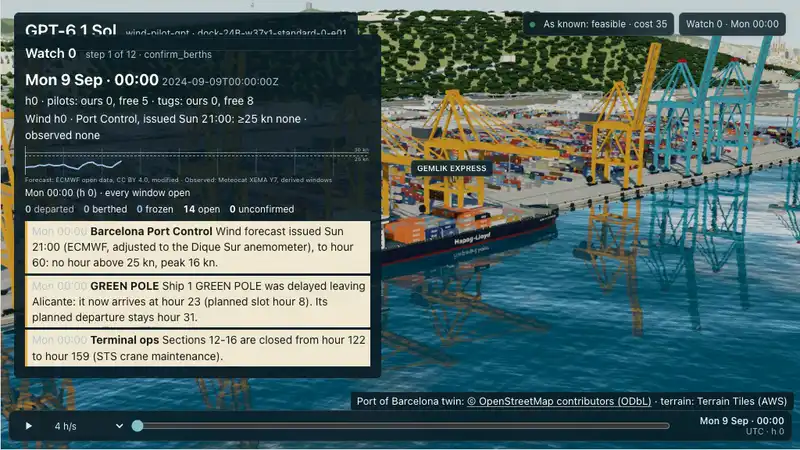
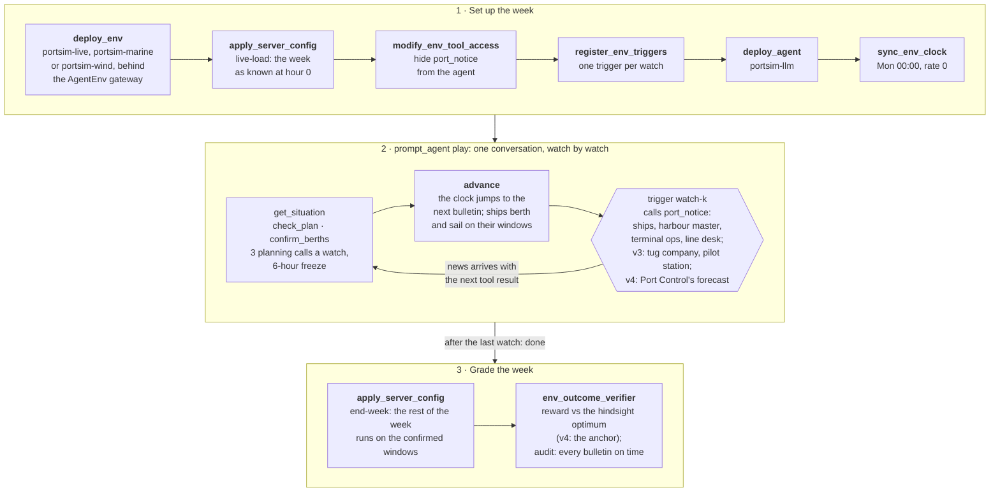
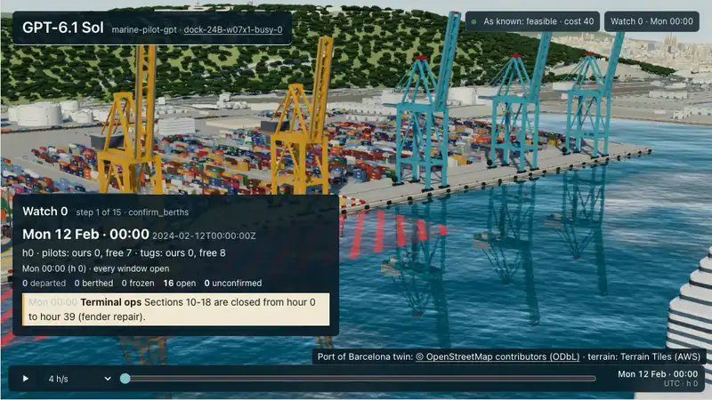

# PortSimEnv for AgentEnv

[](https://github.com/earakely-scale/agentenv-portsim-plugin/actions/workflows/ci.yml)
[](NOTICE)
[](https://www.agentenvframework.com)
[](https://huggingface.co/spaces/earakely-scale/PortSimEnv-AgentEnv)
[](https://huggingface.co/datasets/earakely-scale/PortSimEnv-AgentEnv)

<p align="center">
  <a href="https://github.com/earakely-scale/agentenv-portsim-plugin/releases/tag/replays-2026-10-09"></a>
</p>
<p align="center"><sub><b>The wind port (v4):</b> GPT-6.1 Sol plans <code>dock-24B-w37x1-standard-0-e01</code>, APM Terminals Barcelona's schedule in the wind of the week of 6 March 2023, watch by watch on AgentEnv's virtual clock; the clock shows the schedule's own 2024 dates. At each watch a Barcelona Port Control bulletin gives the ECMWF run published by then: the Thursday 18:00 bulletin (issued 15:00) warns of wind above 25 kn in hours 127–130, and the Friday 12:00 one (issued 09:00) in 125–129. The agent berths VIENNA EXPRESS (335 m) at hour 130, after the latest window. The wind blew above 25 kn from 122 to 135, and above 30 kn to 125: longer and earlier than any forecast showed, so hour 130 is excused. The plan is feasible at 301 against the forecast-following re-planner's 252 (reward 0.62): it works several ships with fewer cranes, and the late arrivals wait. Ignoring the forecast is infeasible (0.187). Replayed on PortSimEnv's 3D viewer; <a href="https://github.com/earakely-scale/agentenv-portsim-plugin/releases/tag/replays-2026-10-09">full film</a>. Twin © OpenStreetMap contributors (ODbL); forecasts ECMWF open data (CC BY 4.0, modified); wind windows derived from Meteocat XEMA Y7.</sub></p>

<details open>
<summary><b>How a live, marine or wind task is built</b>: the task's steps, and the watch loop inside <code>play</code> (details in <a href="#the-live-port">The live port</a>, <a href="#the-marine-port">The marine port</a> and <a href="#the-wind-port">The wind port</a>)</summary>



</details>

In the newest version, the wind port (v4), an agent runs one container quay at the Port of Barcelona in real wind:
each of its 15 weeks is moved into a real Barcelona weather week of 2023 to 2025, 14 of them storms and one a false
alarm. At every watch the forecast arrives in a Barcelona Port Control bulletin, standing in for the port's own
forecasts: the ECMWF run published by then, adjusted to the port's anemometer. The agent plans on the forecasts as
they were issued, and the week is graded on the wind that blew at that anemometer.

In every version the ships and their week come from 2024, and the week has just gone wrong: late and bunched ships,
closed quay sections, crane breakdowns, gales, emergencies. The agent decides when, where along the quay and with how
many cranes every ship docks, and the week is graded deterministically against a plan CP-SAT proved optimal; in the
wind port, against the lower of that plan's cost and a forecast-following re-planner's. The ships and their calls, the
quays' crane fleets and the port's berth and wind rules are real; the workloads and the disruptions are simulated,
except in the wind port, where the simulated gale is gone and the wind and its forecasts are real.

This repository is an environment plugin for the [AgentEnv Framework](https://www.agentenvframework.com), Scale AI's
open-source framework for building RL environments. It is built on **PortSimEnv**, Adithya S Kolavi's environment in
[FineEnvs](https://github.com/adithya-s-k/FineEnvs), called *upstream* below: the quay model, the task packs, the
grader and the 3D viewer come from it, and a week planned in one go plays here exactly as it does there. Read about it
in the article [Simulation RL Environments, part 1](https://huggingface.co/spaces/FineEnvs/simulation-rl-environments),
or play an episode by hand in the [PortSimEnv Space](https://huggingface.co/spaces/FineEnvs/PortSimEnv). The wind
port (v4), the marine port (v3) and the live week (v2) are new here.

**Terms used below:**

- **Watch:** a point in the week where the agent re-plans: watch 0 at hour 0, then one at each bulletin.
- **Bulletin:** the news a watch brings, from ships and the port's services; in v4 also Port Control's forecast.
- **Freeze:** from watch 1 on, a window starting less than 6 hours after the current hour is frozen and can't change.
- **Excuse:** a rule break or cost that news (in v4, unforecast wind too) brought to a window after its last chance
  to change; not charged.
- **Re-planner (rolling):** CP-SAT re-planning at each watch on the week as known; in v4 forecast-following, or blind
  to the wind.
- **Anchor:** what a wind week scores 1.0 at: the lower of the hindsight optimum and the forecast-follower's best cost.
- **Bundle:** what `agent-env run` plays: a folder of tasks and their verifiers, or one a plugin ships (`portsim`).
- **CP-SAT:** Google OR-Tools' constraint solver; it proves the hindsight optimum, the best plan knowing the whole week.

**Contents:** [What's in it](#whats-in-it) · [The model board](#the-model-board) · [Run it yourself](#run-it-yourself) · [Tasks](#tasks) ·
[Play a model](#play-a-model) · [The environment](#the-environment) · [Grading](#grading) ·
[The live port](#the-live-port) · [The marine port](#the-marine-port) · [The wind port](#the-wind-port) ·
[Watch a run](#watch-a-run) · [On the Hugging Face Hub](#on-the-hugging-face-hub) ·
[Built on the AgentEnv Framework](#built-on-the-agentenv-framework) ·
[Layout](#repository-layout) · [Development](#development) · [Licence and credits](#licence-and-credits)

## What's in it

- **Four environments, in one image.**
  - **v4, the wind port,** `portsim-wind`, plays v3's marine week in a real Barcelona weather week of 2023 to 2025: the
    wind that blew at the port's anemometer sets the rules, and at every watch the forecast arrives in a Barcelona Port
    Control bulletin, standing in for the port's own forecasts: the ECMWF run published by then, adjusted to that
    anemometer ([The wind port](#the-wind-port)).
  - **v3, the marine port,** `portsim-marine`, plays v2's live week with the port's pilots and tugs: every berthing
    and departure takes them from hourly pools shared with the rest of the port's real 2024 traffic, and the tug
    company and the pilot station announce cuts ([The marine port](#the-marine-port)).
  - **v2, the live port,** `portsim-live`, plays v1's week as it unfolds, on AgentEnv's gateway. A virtual clock
    runs the week watch by watch, the ships, the harbour master, terminal ops and the line desk send their news through
    triggers, and windows about to start are frozen. The agent confirms berths as it goes
    ([The live port](#the-live-port)).
  - **v1,** `portsim`, plans a week in one go: the agent reads the situation, checks drafts (10 checks) and submits
    one plan, within 24 tool calls ([The environment](#the-environment)).
- **1,100 weeks to play.** They come from the port's 2024 container calls at two quays, 24B (APM Terminals
  Barcelona) and 36A (Terminal Catalunya, BEST), in four tiers from standard to extreme: 50 eval weeks and 1,050
  train weeks, with no week in both. 15 of the eval weeks are live weeks, and the same 15 are marine weeks; 11 of
  them, moved into real weather weeks, make the 15 wind weeks ([Tasks](#tasks)).
- **A deterministic grade, with no judge.** A valid plan scores 0.2 + 0.8·e^(−[gap](#grading)/0.5) against the
  optimum (in the wind port, the anchor), which scores 1.0. A plan that breaks a rule scores under 0.2 (down to 0),
  and a run that submits nothing scores 0. A live week is graded on the windows the agent confirmed, against the week
  as it really happened ([Grading](#grading)).
- **An agent.** `portsim-llm` plays a week with a model through agent-env's endpoint: the Hugging Face router for
  open models, or a LiteLLM proxy ([Play a model](#play-a-model)).
- **Commands.**
  - `agent-env portsim setup` builds the env image and registers the four envs; with `--agent`, also the
    `portsim-llm` agent.
  - `tasks generate`, `sweep run` and `sweep report` play models over the weeks under a spend cap.
  - `view` and `record` replay runs on a 3D twin of the quay and film them ([Watch a run](#watch-a-run)).
- **On the Hugging Face Hub.** The dataset
  [earakely-scale/PortSimEnv-AgentEnv](https://huggingface.co/datasets/earakely-scale/PortSimEnv-AgentEnv) holds the
  weeks of every version, the wind, marine and live references and every recorded run; its default table is the wind
  weeks. It has PortSim's own tables for each version and agentenv-hf's standard tables for each runnable bundle (the
  15 wind weeks, the 15 marine weeks, the 15 live weeks and the 50 eval weeks). The plugin installs
  [agentenv-hf](https://github.com/earakely-scale/agentenv-hf-plugin), so `agent-env hf run` plays a week straight
  from the dataset and `agent-env hf publish` publishes your own runs. The
  [Space](https://huggingface.co/spaces/earakely-scale/PortSimEnv-AgentEnv) replays the runs in 3D
  ([On the Hugging Face Hub](#on-the-hugging-face-hub)).
- **Results.** Twelve models on the 15 live, 15 marine and 15 wind weeks ([the model board](#the-model-board)), and
  GPT-6.1 Sol and Claude Sonnet 5.5 first on the 15 wind weeks ([wind results](#wind-results)), on the 15 marine weeks
  ([marine results](#marine-results)), on all 15 live weeks
  ([the first live results](#the-first-live-results)) and on ten weeks planned in one go
  ([the comparison with upstream's eval](#the-comparison-with-the-published-eval)).

## The model board

Twelve models play every live, marine and wind week once, 540 runs, on the same harness (`portsim-llm`,
[Play a model](#play-a-model)) with the same prompts, tools and limits, through Scale's LiteLLM proxy: Claude Opus,
Sonnet and Haiku 5.5 on Anthropic's API; GPT-6 Astra, GPT-6.1 Sol and GPT-6 Luna on the Responses API, served by Azure
OpenAI; Kimi K3, GLM-5.3, GLM-5.3-Flash, Qwen3.8-2.4T and DeepSeek V4.1 Flash on Fireworks; and Qwen3.8-27B on Groq,
with Groq's limit of 16,384 output tokens a reply. Four of them are the open models of
[upstream's eval](#the-comparison-with-the-published-eval), which ran them on other providers through the Hugging Face
router; the same weights can score differently on another provider. Mean reward on each version and over all 45 weeks:

| Model | Provider | v4, the wind port | v3, the marine port | v2, the live port | All weeks | Feasible weeks |
|---|---|---:|---:|---:|---:|---:|
| GPT-6 Astra | Azure OpenAI | 0.896 | 0.956 | 0.984 | **0.945** | 44 of 45 |
| Claude Opus 5.5 | Anthropic | 0.906 | 0.951 | 0.976 | **0.944** | 45 of 45 |
| Claude Sonnet 5.5 | Anthropic | 0.888 | 0.932 | 0.904 | **0.908** | 45 of 45 |
| GPT-6.1 Sol | Azure OpenAI | 0.745 | 0.905 | 0.957 | **0.869** | 41 of 45 |
| Claude Haiku 5.5 | Anthropic | 0.583 | 0.639 | 0.694 | **0.639** | 44 of 45 |
| Qwen3.8-2.4T | Fireworks | 0.662 | 0.519 | 0.686 | **0.622** | 28 of 45 |
| DeepSeek V4.1 Flash | Fireworks | 0.480 | 0.598 | 0.754 | **0.611** | 28 of 45 |
| GLM-5.3 | Fireworks | 0.468 | 0.593 | 0.748 | **0.603** | 28 of 45 |
| GLM-5.3-Flash | Fireworks | 0.328 | 0.461 | 0.470 | **0.420** | 18 of 45 |
| Kimi K3 | Fireworks | 0.249 | 0.446 | 0.465 | **0.386** | 18 of 45 |
| GPT-6 Luna | Azure OpenAI | 0.320 | 0.287 | 0.335 | **0.314** | 36 of 45 |
| Qwen3.8-27B | Groq | 0.090 | 0.073 | 0.055 | **0.073** | 0 of 45 |

- **GPT-6 Astra and Claude Opus 5.5 share the top,** within each other's CIs in every version; Claude Sonnet 5.5 is
  level with them on the wind and marine weeks and below them on the live ones. Opus and Sonnet broke no rule in any
  of their 45 weeks, Astra in one.
- **The best open models score like a small closed one, but break far more rules.** Qwen3.8-2.4T, DeepSeek V4.1 Flash
  and GLM-5.3 average within noise of Claude Haiku 5.5, but Haiku keeps 44 of its 45 weeks feasible and each of them
  28. The rule breaks are overlapping berths, more cranes than the quay has, ships berthed before they arrive and ships
  left without a window; a wind window is broken in 6 of the 180 wind runs.
- **The wind port is the hardest:** eight of the twelve models score lower at each step from the live port to the
  marine port to the wind port.
- **Every model checks its drafts; not every model heeds the check.** Confirming windows straight after a check that
  reported problems runs from at most 5% of the time (Claude Opus 5.5) to 94% or more (Qwen3.8-27B).
- **Qwen3.8-27B,** the one model small enough to fine-tune cheaply, never found a valid plan.

[results/board.md](results/board.md) has each version's table, what breaks, checking and heeding, cost, how it was run
and the caveats. One run per model and week, so the CIs, a bootstrap over the weeks, are wide. The board is on the Hub
as the dataset's `results` table and as `results/v2.json` to `results/v4.json`, in the shape of PortSimEnv's article
data; every run, with its transcript, is in `v2_episodes` to `v4_episodes` and replays in the
[Space](https://huggingface.co/spaces/earakely-scale/PortSimEnv-AgentEnv).

These scores are not comparable with upstream's v1 eval. The live, marine and wind weeks are new environments: the
agent re-plans with four tools, at most 3 planning calls a watch and 47 turns a week (52 on the wind port), where v1
plans the week in one go with 12 turns and 10 checks; and each version plays 15 weeks drawn from the one-week standard
and busy eval weeks, where v1's eval plays 50 weeks across four tiers. Rankings don't carry over: on v1 GLM-5.3-Flash
scores above GLM-5.3, here below. The like-for-like v1 check is
[The comparison with the published eval](#the-comparison-with-the-published-eval).

## Run it yourself

You need [Docker](https://docs.docker.com/get-docker/), running and usable without `sudo`, with its buildx plugin,
[uv](https://docs.astral.sh/uv/) and git. The smoke check needs no model key: the tasks in the bundle call no model.

```bash
uv tool install agentenv-framework \
    --with "agentenv-portsim @ git+https://github.com/earakely-scale/agentenv-portsim-plugin@v0.4.5"
agent-env portsim setup              # build the env image for this machine; register the envs "portsim", "portsim-live", "portsim-marine" and "portsim-wind"
agent-env run portsim --task smoke   # load a task, submit its optimal plan, grade it
```

The run prints `tasks/smoke.json v1: passed` with the score (1), the time and the instance id; the run and its grade
are stored under `~/.local/state/agent-env`. `setup` has Docker build the images from the GitHub commit the plugin was
installed from, so it needs no clone.

Then play a wind week with a model, straight from the Hub. `agent-env hf run` comes with the plugin; the model here
runs on the Hugging Face router, with a token that can make calls to Inference Providers on an account with credits
(other endpoints: [Play a model](#play-a-model)):

```bash
agent-env portsim setup --agent        # also builds and registers portsim-llm, the agent that plays the model
export HF_TOKEN=hf_...                  # with "Make calls to Inference Providers", on an account with credits
export LITELLM_BASE_URL=https://router.huggingface.co/v1 LITELLM_API_KEY=$HF_TOKEN
agent-env hf run earakely-scale/PortSimEnv-AgentEnv@v0.4.5 --task dock-36A-w06x1-standard-0-e07 \
    --model zai-org/GLM-5.3-Flash:baseten   # the shortest wind week, 4 watches
```

It downloads the dataset's bundles at that tag, shows what it will run and asks before it runs; the task stops the
episode before it could spend $5. It prints the reward and the instance id, as `agent-env run` does; to replay a week
in 3D, play it as a sweep ([Publish your own runs](#publish-your-own-runs) has the sweep and the `view`).
[On the Hugging Face Hub](#on-the-hugging-face-hub) has the other bundles and `agent-env hf publish`.

agent-env reads `.agentenv/config.toml` from the directory it runs in or the nearest one above it that has one.
Without one, it runs on its local defaults: stores under `~/.local/state/agent-env/`, images in a registry at
`localhost:5000` that it starts on first push, and the env as a container on this machine's Docker.
[`.agentenv/config.example.toml`](.agentenv/config.example.toml) describes that profile and the `modal_vm` one.

To change the plugin, work from a clone; `setup` then builds the checkout:

```bash
git clone https://github.com/earakely-scale/agentenv-portsim-plugin
uv tool install agentenv-framework --with-editable ./agentenv-portsim-plugin
cd agentenv-portsim-plugin && agent-env portsim setup
```

`setup` builds for the Docker host's own platform (`linux/arm64` on Apple Silicon). For Modal, put the `modal_vm`
profile in `.agentenv/config.toml`, set its `repository_prefix` to your own GHCR namespace, and run
`agent-env portsim setup --platform linux/amd64`, which pushes the image to `ghcr.io/<namespace>/agentenv-portsim-env`.
Pushing needs `docker login ghcr.io` with a token that can write packages; Modal's VMs pull the image without
credentials, so make the package public; and Modal needs `modal token new`. Run live, marine and wind weeks on the local
profile ([Play a live week](#play-a-live-week) says why). In an existing agent-env install,
`agent-env plugin add ./agentenv-portsim-plugin` adds a clone of the plugin.

<details>
<summary>Troubleshooting</summary>

- **`agent-env: command not found`:** uv installed it in a directory that isn't on your PATH yet; run
  `uv tool update-shell` and open a new terminal.
- **A step fails because something holds port 5000:** agent-env keeps its images in a local registry on
  `127.0.0.1:5000`. On macOS, AirPlay Receiver often holds that port; turn it off in System Settings.
- **The run says there is no env `portsim`, `portsim-live`, `portsim-marine` or `portsim-wind`:** run `agent-env portsim setup` first, with the same config.
- **A model run fails with `provider_refused`:** the model endpoint refused the key or the account (401, 402 or 403).
  On the Hugging Face router, 402 means the account has no Inference Providers credits: add some, or bill an
  organization with `--hf-bill-to` on `tasks generate` or `sweep run`. `agent-env hf run` has no such option, so
  there the token's own account needs the credits.
</details>

## Tasks

The bundle `portsim` holds three wiring tasks. Each deploys the env, loads a task with `urn:portsim:load-task/v1`
and is graded by `portsim-verifier`:

| Task | What it does | Score |
|---|---|---|
| `smoke` | submits the task's optimal plan through `urn:portsim:submit-plan/v1` | 1, so it prints `passed` |
| `wiring-infeasible` | submits a plan that breaks the rules | at most 0.2 |
| `wiring-nosubmit` | submits nothing | 0 |

```bash
agent-env run portsim --task smoke --task wiring-infeasible --task wiring-nosubmit
```

The env holds both of upstream's dock-v1 packs, built from the port's 2024 container calls at quays 24B (APM
Terminals Barcelona) and 36A (Terminal Catalunya, BEST):

| Pack | Tasks | Tiers | Ships |
|---|---:|---|---|
| dock-v1-eval | 50 | standard 9, busy 15, storm 13, extreme 13 | 14 to 59 |
| dock-v1-train | 1,050 | standard 266, busy 260, storm 262, extreme 262 | 12 to 90 |

Ids read `dock-<quay>-w<week>x<weeks>-<tier>-<seed>`, e.g. `dock-24B-w07x1-busy-0`. No week appears in both packs.
To put a model on them, see [Play a model](#play-a-model). The live and marine ports play one-week dock-v1-eval weeks
under their own ids ([The live port](#the-live-port), [The marine port](#the-marine-port)); the wind port plays the
pack `dock-v1-wind`, whose 15 weeks end in their weather week, e.g. `dock-24B-w37x1-standard-0-e01`
([The wind port](#the-wind-port)).

## Play a model

`portsim-llm` (`agents/portsim-llm/agent.py`) is upstream's harness loop as an A2A agent. It keeps upstream's system
prompt and opening message, its nudges, notes and limits (12 turns, 32,000 output tokens a turn) and the episode
record upstream publishes, and it calls each model on the API upstream used for its provider, through agent-env's
model endpoint:

| Model id | API |
|---|---|
| `anthropic/...` | Messages, streamed |
| `openai/...` | Responses, streamed, with encrypted reasoning, effort `medium` and summary `auto` |
| any other | chat completions, streamed |

Name the endpoint in `.agentenv/config.toml`, or set `LITELLM_BASE_URL` and `LITELLM_API_KEY`. The open models
upstream evaluated go through the [Hugging Face router](https://huggingface.co/docs/inference-providers), as upstream
runs them, with a Hugging Face token that can make calls to Inference Providers on an account with credits:

```toml
[model]
base_url = "https://router.huggingface.co/v1"
api_key  = "env:HF_TOKEN"
```

Its models here are `Qwen/Qwen3.8-2.4T-A95B:together`, `Qwen/Qwen3.8-27B:ovhcloud`, `zai-org/GLM-5.3-Flash:baseten`
and `zai-org/GLM-5.3:together`. To bill an organization instead of the token's own account, pass `--hf-bill-to <org>`
to `tasks generate` or `sweep run`; the agent sends it as `X-HF-Bill-To`. The closed models go through a
[LiteLLM](https://docs.litellm.ai/) proxy:

```toml
[model]
base_url = "https://your-litellm-proxy"
api_key  = "secret:PORTSIM_MODEL_KEY"   # read through [stores.secret]; the local store takes it from the env var
```

Then build both images, write the eval tasks and play one:

```bash
agent-env portsim setup --agent                        # the env and portsim-llm, for this machine
agent-env portsim tasks generate --pack dock-v1-eval   # 50 tasks in results/bundles/dock-v1-eval
agent-env run results/bundles/dock-v1-eval --task dock-24B-w06x1-busy-0 --model zai-org/GLM-5.3-Flash:baseten
```

Each task deploys the env, loads its PortSim task, deploys `portsim-llm`, plays one episode and grades the plan with
`portsim-verifier`. A task names no model; `--model` picks it.

What differs from upstream's harness:

- **The env** is reached over MCP. MCP has no done flag, so the episode ends when `submit_plan` reports
  `"submitted": true` or after the 24th call.
- **One endpoint.** Upstream's chains of fallback providers are gone; every model goes through the endpoint agent-env
  is configured with.
- **Cost.** Each turn's token usage is priced from a table pinned in the agent, which holds the twelve models of
  [the model board](#the-model-board) as a LiteLLM proxy names them (`anthropic/claude-opus-5-5`,
  `openai/gpt-6-astra`, `fireworks_ai/kimi-k3`, `groq/qwen/qwen3.8-27b` and so on) and the four open models on the
  Hugging Face router; any other model fails before its first request. A request whose usage never arrives (it failed,
  or the harness cut its stream) is charged the most it could have cost, except one the provider refused (401, 402 or
  403: the key or the account), which costs nothing and ends the run as `provider_refused`. The episode stops before a
  request that could take its spend past `PORTSIM_MAX_COST_USD` ($5 in the generated tasks).
- **Failures.** A model error after the SDK's retries, an env error, a turn that would start after the task's two
  hours, or the cost cap fails the run as an infrastructure error, with the episode so far, instead of scoring it.
  Chat completions retry eight times, about 40 seconds, because a provider's tokens-per-minute limit (Groq's) answers
  429 until its minute turns. A reply that fails after its stream began (the SDKs' retries stop there) is sent again,
  up to twice, since no tool has run on it; the record lists each resend among its errors. A tool call whose arguments
  aren't a JSON object goes back into the model's history as `{}`, its result saying why, since Fireworks refuses a
  history that holds one; the record keeps what the model sent.
- **Provider limits.** Groq takes at most 16,384 output tokens a reply, so `groq/qwen/qwen3.8-27b` plays with that
  limit instead of 32,000.

A sweep plays models over tasks and reps under a spend cap, and reports them against the published eval:

```bash
agent-env portsim sweep run --name pilot --models anthropic/claude-sonnet-5-5,openai/gpt-6.1-sol --tasks g2 \
    --cap-usd 20
agent-env portsim sweep report pilot   # results/parity.md
```

- Each attempt is its own `agent-env run` process. Its log, its row in `results.jsonl` and the agent's transcript go
  to `results/runs/<name>/`.
- `--tasks` takes `all`, `g2` or task ids; `g2` is the ten weeks of
  [the comparison](#the-comparison-with-the-published-eval).
- An attempt starts only if the spend so far plus the episode cap (`--episode-cap-usd`, default $5) of every attempt
  running, the new one included, stays within `--cap-usd`. An attempt whose spend isn't known counts at its cap.
- A failed attempt is retried up to twice; an episode stopped at its cost cap, or refused by the provider, is not.
  Running the same sweep again resumes it. Ctrl-C, or an error in the sweep itself, tears the running attempts down
  and records them.
- `report` compares each model with its episodes in the published dock-eval50 run (`data/published/`) on the same
  tasks: means with upstream's bootstrap CIs, the difference per task, per tier and week by week, with submitted,
  feasible and optimal counts, turns, tokens and cost.

### The comparison with the published eval

The comparison plays `portsim-llm` with the published closed models, `openai/gpt-6.1-sol` and
`anthropic/claude-sonnet-5-5`, on ten eval weeks, and sets each week's reward next to the published one. It reports
the differences without a pass or fail line. The first run, sweep `g2` on Modal VMs, is in
[`results/parity.md`](results/parity.md); it cost $5.19 for 20 episodes:

| Model | Ours, mean of 10 weeks | Published, same 10 weeks | Weeks within ±0.05 | Tokens in/out per episode, ours / published |
|---|---:|---:|---:|---|
| GPT-6.1 Sol | 0.907 | 0.872 | 9 of 10 | 30.3k/6.7k / 29.4k/6.6k |
| Claude Sonnet 5.5 | 0.778 | 0.839 | 7 of 10 | 48.1k/26.2k / 107.2k/30.4k |

Each week is one episode on each side, so a single week can differ by a lot: GPT-6.1 Sol scored 1.0 on
`dock-36A-w35x2-extreme-0` where the published run has 0.700, and on the 56-ship storm week Sonnet 5.5 spent both of
its turns' 32k output tokens without calling a tool and ended with 0 (the published episode played 8 turns and scored
0.379), which also accounts for most of the gap in Sonnet's input tokens. Per turn, input and output tokens track the
published episodes.

The ten weeks (`--tasks g2`) were fixed from the pack alone, before any model played them:

1. The tiers share the ten slots in proportion to their size, by largest remainder (ties in the order standard, busy,
   storm, extreme): standard 2, busy 3, storm 3, extreme 2.
2. A tier of N tasks, sorted by (ships, task id), gives its n weeks at positions ⌊(2i+1)·N/(2n)⌋ for i = 0…n−1: the
   middle task of each of n equal slices of that order.

| Tier | Weeks (ships) |
|---|---|
| standard | `dock-36A-w35x1-standard-0` (19), `dock-36A-w17x1-standard-0` (29) |
| busy | `dock-24B-w06x1-busy-0` (17), `dock-36A-w05x1-busy-0` (27), `dock-36A-w05x2-busy-0` (51) |
| storm | `dock-24B-w35x2-storm-0` (24), `dock-24B-w06x2-storm-0` (32), `dock-36A-w15x2-storm-0` (56) |
| extreme | `dock-24B-w35x2-extreme-1` (25), `dock-36A-w35x2-extreme-0` (39) |

Both quays are in it: four weeks at 24B and six at 36A. `tests/sweep/` recomputes the list from the pack.

## The environment

`PortSimEnv` (`src/agentenv_portsim/server.py`) serves upstream's three tools:

| Tool | What it does |
|---|---|
| `get_situation()` | The quay, notices, ships already alongside, closed sections, cranes, wind windows and the table of ships to berth, as Markdown. It still answers after the episode ends |
| `check_plan(plan)` | Rule violations, departure, delay and cost per ship, and the plan's cost, as JSON with `checks_left`. 10 an episode; it doesn't grade the plan |
| `submit_plan(plan)` | Grades the plan and ends the episode: `submitted`, `feasible` and `reward`, then the cost, delay cost and moves of a valid plan, or the violations of one that isn't |

A plan has one entry per ship, `[{"ship": 0, "berth_hour": 36, "section": 22, "cranes": 3}, ...]`, where `cranes`
defaults to the ship's planned cranes; it can also be sent as a string. Every tool call counts toward the limit of
24, failed ones included, and a 24th call that isn't a submit ends the episode with reward 0. Once the episode is
over, `check_plan` and `submit_plan` return an error.

For the harness, not the agent:

| Surface | What it does |
|---|---|
| `urn:portsim:load-task/v1` `{"task_id": ...}` | Loads the task and resets the counters; an unknown id is an error |
| `urn:portsim:submit-plan/v1` `{"plan": ...}` | Does what `submit_plan` does; the wiring tasks use it |
| `data/reset` | Clears the episode |
| `data/get` | `task_id`, `checks_used`, `calls_used`, `done`, `end_reason`, `plan`, `grade` and `reward`; never the task's reference plans (the grade, there only after a submit, includes the optimal and naive costs) |

## Grading

The env grades a submitted plan once, with `berth_core`'s reward v3, which every dock-v1 task uses:

- A plan that breaks any rule, or has entries the checker can't use, scores 0.2 times the fraction of clean ships,
  so less than 0.2.
- A valid plan scores 0.2 + 0.8·e^(−g/0.5), with g = max(0, cost − optimum) / (max(0, optimum − floor) + 100). The
  optimum is the cost of the CP-SAT plan and the floor the cost no plan can avoid, so the optimum scores 1.0.
- An episode that ends without a submit scores 0.

Rewards are rounded to six decimals, and the same plan always gets the same reward. `portsim-verifier` reads
`data/get` and reports one row whose score is the reward, so with `weighted_average` the task's score is the reward
itself. If the env can't answer `data/get`, the verifier raises and the run fails rather than scoring 0.
`agent-env run` prints `passed` only for a score of 1; any other reward prints `scored below 1` with the score.

## The live port

The live port is v2: the same quay and the same weeks, played as they unfold. The env `portsim-live`
(`src/agentenv_portsim/live.py`) starts a one-week task at Monday 00:00 with only what the port knows then. The rest
reaches the agent during the week: ships report delays and unscheduled calls, the harbour master issues gale warnings
and emergencies, terminal ops announce crane outages, and the line desk flags priority cargo. The agent confirms
berth windows as it goes. The week is graded once, on the windows it confirmed, against the week as it really
happened. The live port runs on the AgentEnv gateway: the gateway's virtual clock is the port's clock, its triggers
deliver the news, and a per-role rule hides the tool they deliver it through. The `portsim` env and its tasks are
unchanged.

<p align="center">
  <a href="https://github.com/earakely-scale/agentenv-portsim-plugin/releases/tag/replays-2026-10-07"></a>
</p>
<p align="center"><sub><b>The live port (v2):</b> GPT-6.1 Sol runs the same week as it unfolds on AgentEnv's virtual clock, without pilots and tugs. The week opens with a quay closure; an unscheduled call, an emergency, late ships, a crane outage, a gale and bunched arrivals come in as bulletins; it re-plans each watch and ends at the hindsight optimum (reward 1.0). <a href="https://github.com/earakely-scale/agentenv-portsim-plugin/releases/tag/replays-2026-10-07">Full films</a>. Twin © OpenStreetMap contributors (ODbL).</sub></p>

### How a live week runs

- **Watches.** A week is played in watches: watch 0 at hour 0, then one per news bulletin, 2 to 9 watches in all.
  At watch 0 the agent sees the week as known at hour 0: the published arrivals, the closures, which are planned
  works, and no unscheduled calls.
- **`advance`.** Time passes only when the agent calls `advance`. The port moves to the next bulletin, ships berth
  and sail on their confirmed windows, and the bulletin's messages arrive with the next tool result. No time passes
  while the model thinks.
- **The freeze.** From watch 1 on, a window that starts before the freeze line, 6 hours after the current hour, is
  frozen: the harbour master refuses to change it, and new or changed windows must start at or after the line.
- **Planning calls.** `check_plan` and `confirm_berths` share 3 calls a watch.
- **The end.** After the last watch, `advance` returns `done` with the week's reward. An agent that stops early is
  graded on what it confirmed: the task's next step runs the remaining watches with no changes, then grades the week.

The example week `dock-24B-w07x1-busy-0` has 17 ships and a hindsight optimum of 226. The agent gets the task's own
notices, verbatim; in short:

| Watch | Time (hour) | From | News |
|---:|---|---|---|
| 0 | Mon 00:00 (0) | Terminal ops | Sections 10-18 closed from hour 0 to 39 |
| 1 | Tue 06:00 (30) | MAERSK NUBA | Unscheduled call: arrives at hour 58, asks to sail by 74 |
| 2 | Tue 18:00 (42) | Harbour master | Emergency: ZIM CHINA must dock by hour 64; each hour later costs 60 |
| 3 | Wed 06:00 (54) | CARLOTA B | Delayed: arrives at hour 93 (planned slot 78) |
| 4 | Thu 12:00 (84) | MAERSK NARMADA; Terminal ops | Delayed: arrives at hour 129 (slot 112); 2 of 9 cranes out from hour 108 to 155 |
| 5 | Thu 18:00 (90) | Harbour master | Gale: no ship of 300 m or more berths or leaves from hour 115 to 144, and no ship at all from 117 to 126 |
| 6 | Sat 00:00 (120) | Ship agents | Ships 12, 13 and 14 now arrive together between hours 156 and 168 |

Each kind of news is revealed a fixed time before the hour it is about (`src/agentenv_portsim/schedule.py`):

| News | Revealed |
|---|---|
| Closure | at hour 0 |
| Late ship, bunched ships | 24 hours before the original arrival |
| Unscheduled call, priority cargo | 24 hours before the arrival |
| Emergency | 12 hours before the arrival |
| Crane outage, gale | 24 hours before it starts |

Reveal times are floored at hour 0 and rounded down to a 6-hour bulletin. A ship's priority or emergency notice
never comes before its own delay or call. On every one-week task, each notice after hour 0 comes at least 12 hours
before the hour it is about, more than the 6-hour freeze. So a ship's own news never concerns a frozen window; an
outage or a gale still can, and the [excuses](#the-live-grade) cover that.

### The live env

`PortSimLiveEnv` serves four tools to the agent. Every result is one JSON object that ends with the messages not yet
read. A plan is a list of windows, `[{"ship": 7, "berth_hour": 95, "section": 4, "cranes": 2}, ...]`; ships left out
keep their confirmed windows.

| Tool | What it does |
|---|---|
| `get_situation()` | The watch and its time, the week as known now in upstream's Markdown, the confirmed windows (departed, berthed, frozen or open), the ships without a window, and the planning calls left. It still answers after the week ends |
| `check_plan(plan)` | Checks the windows merged over the confirmed ones, on the week as known now, and confirms nothing: the ships with a problem or a cost, the plan's cost, and the entries `confirm_berths` would refuse. A problem or cost that news brought to a frozen window is listed as excused and not counted |
| `confirm_berths(plan)` | Sets or changes the windows it lists. Each refusal carries the harbour master's reason |
| `advance()` | Ends the watch and returns the new watch, its hour, the ships berthed and departed, the freeze line and the ships without a window. After the last watch it returns `done` with `feasible`, `cost` and `reward` |

Once the clock is armed, the gateway also offers the agent its own `get_time`. Those calls never reach the env, so
the env's `calls_used` leaves them out.

For the harness, not the agent:

| Surface | What it does |
|---|---|
| `urn:portsim:live-load/v1` `{"task_id": ...}` | Starts the week. One-week tasks only, and one week per deployed env |
| `port_notice(event_id, name, text)` | Delivers one notice: the env applies the news and queues the message. The triggers call it; it is hidden from the agent's role |
| `urn:agentenv:clock/v1` `sync_time` | Takes the gateway clock's URL. From then on, each `advance` sets the clock to the next bulletin |
| `urn:portsim:end-week/v1` | Runs the watches the agent didn't reach, with no changes, then grades and audits the week |
| `data/reset` | Clears the week |
| `data/get` | The plan, the notice log, the frozen windows of each watch, refusals, excused problems and cost, the audit, the grade and the reward. Never the task's reference plans |

The bundle `portsim-live` holds two tasks: `week` plays `dock-24B-w07x1-busy-0` with `portsim-llm`, and
`wiring-noplay` runs the same steps without `deploy_agent` and `prompt_agent`. The steps of `week`, as of every live
task:

```
deploy_env              portsim-live, on the gateway
apply_server_config     urn:portsim:live-load/v1 {task_id}
modify_env_tool_access  disable port_notice for the role default
register_env_triggers   watch-1 ... watch-N
deploy_agent            portsim-llm
sync_env_clock          the week's start, rate 0 (stopped)
prompt_agent            the live rules and the watch-0 briefing, 5 turns a watch plus 2
apply_server_config     urn:portsim:end-week/v1
env_outcome_verifier    portsim-live-verifier
```

The trigger `watch-k` fires when `advance` returns `"watch": k`. It calls `port_notice` once for each of the watch's
notices, in order, and its barrier holds the agent's next call until they are applied. That is why the messages come
with the next result, and why the rules tell the agent to call `advance` and `get_situation` in one turn.

**The clock.** The env moves the gateway's clock itself. `sync_env_clock` arms the clock at the week's start with rate
0, and the gateway gives the env its clock URL through `urn:agentenv:clock/v1`. At each `advance`, the env calls the
gateway's `PUT /clock/set-time` with the next bulletin's time, again at rate 0. It finds that route by replacing `time`
with `set-time` at the end of the clock URL. So `get_time`, the trajectory's timestamps and the trigger log all show
the watch's time, and they hold still between watches. The gateway hands a server the clock URL to read the clock;
setting the clock from the env is this env's own use of the gateway's route, which takes no credentials.

### The live grade

- **The executed week.** The confirmed windows are checked against the true week and scored with `berth_core`'s
  reward v3, against the hindsight optimum and the floor, as in v1. An infeasible week scores below 0.2, and the
  hindsight optimum scores 1.0.
- **Excuses.** At each notice, the env checks the frozen windows on their own, before and after the news. A rule
  break or a cost that only the news added to a frozen window is not charged, and `check_plan` lists it as excused.
  For example, in the week above CARLOTA B is confirmed at hour 95 and frozen when the gale is announced at hour 90.
  It then has to wait alongside for the gale to pass. That adds 20 to the cost, which is excused, so the week still
  scores 1.0 (0.81 if the 20 were charged).
- **The audit.** A week is valid when:
  - every watch reached got exactly its scheduled notices, in order, before the agent's next call;
  - every notice after hour 0 came at least 6 hours ahead;
  - a finished week revealed each notice once.

  For a valid week, `portsim-live-verifier` scores the run with the week's reward and adds an audit row with weight 0.
  For a week that never finished or failed the audit, it raises, so the run is not scored.

### The references and the live weeks

`data/live/references.jsonl` plays each of the 18 one-week dock-v1-eval weeks two ways. Both go through the same week
model and grader as the env:

- **Rolling.** CP-SAT re-plans the week as known at every watch, with the frozen windows pinned and every other ship
  at or after the freeze line.
- **Naive.** The policy keeps each window that still fits. It moves the rest to the earliest legal hour at or after
  the freeze line, on the nearest section, with the same cranes.

A week is a live week when the rolling re-planner reaches the hindsight optimum under at least 3 of 4 solver
configurations: 1 or 8 workers, each with or without an earliest-finish tie-break. That way, 1.0 is reachable on what
the agent could know. 15 of the 18 weeks qualify:

| Tier | Live weeks (ships, watches) |
|---|---|
| standard | `dock-24B-w06x1-standard-0` (16, 4), `dock-24B-w37x1-standard-0` (15, 4), `dock-36A-w06x1-standard-0` (24, 3), `dock-36A-w10x1-standard-0` (32, 2), `dock-36A-w15x1-standard-0` (30, 4), `dock-36A-w35x1-standard-0` (19, 5), `dock-36A-w37x1-standard-0` (22, 5) |
| busy | `dock-24B-w06x1-busy-0` (17, 4), `dock-24B-w07x1-busy-0` (17, 7), `dock-24B-w16x1-busy-0` (16, 9), `dock-24B-w35x1-busy-0` (14, 8), `dock-36A-w05x1-busy-0` (27, 5), `dock-36A-w06x1-busy-0` (25, 6), `dock-36A-w17x1-busy-0` (28, 5), `dock-36A-w37x1-busy-0` (23, 7) |

On these 15 weeks the rolling re-planner scores 1.0 and the naive policy 0.2025 on average. Three weeks are left out:

- `dock-36A-w15x1-busy-0`: every configuration reaches 194, against an optimum of 153.
- `dock-36A-w16x1-standard-0`: only 1 of the 4 configurations reaches the optimum.
- `dock-36A-w17x1-standard-0`: only 2 of the 4 do.

`ortools` isn't a dependency of this package. The script runs CP-SAT on a deterministic time limit, with the 8-worker
search interleaved so that it reproduces, and takes about 4 minutes:

```bash
uv run --with ortools==9.15.6755 python scripts/live_references.py
```

The tests replay the stored plans without ortools and check that they reproduce the stored costs. The rolling
re-planner assumes news never leaves the frozen windows breaking a rule on their own. That holds on these 18 weeks;
on another week the script would stop.

### Play a live week

Live weeks run on local Docker for now. On the `modal_vm` profile, the gateway loads every image as a tarball from the
object store at each deploy, about an hour per deploy from that profile's local file store. `setup` still registers
`portsim-live` there, but run live weeks on the local profile.

```bash
agent-env portsim setup --agent                    # also registers portsim-live, on the gateway, with the same image
agent-env run portsim-live --task wiring-noplay    # no model: no window confirmed, so it scores 0 with the audit ok
agent-env run portsim-live --task week --model anthropic/claude-sonnet-5-5   # dock-24B-w07x1-busy-0, 7 watches
agent-env portsim tasks generate --pack dock-v1-eval --live   # the 15 live weeks in results/bundles/dock-v1-eval-live
```

`portsim-llm` plays live when the env lists `advance`:

- There is no 24-call limit.
- Every week gets 47 turns: 5 a watch (`get_situation`, three planning calls, `advance`) for the longest week's 9
  watches, plus 2. One number for all weeks keeps the `(turns left: N)` note from revealing how many bulletins are coming.
- The episode ends when `advance` reports `done`, and takes its reward from it.
- The last-turn and no-tool nudges name the live tools.
- On the Messages API, each request carries one cache breakpoint, on the newest message.
- v1 episodes send the same requests as before.

A live sweep works like a v1 sweep, with `--live`:

```bash
agent-env portsim sweep run --live --name live-pilot --models anthropic/claude-sonnet-5-5 --tasks g2 --cap-usd 6
agent-env portsim sweep report --live live-pilot   # results/live.md
```

- `--tasks all` takes the G2 weeks first, then the rest by watch count, so a spend stop drops the longest weeks.
  `g2` is the three G2 weeks among the live weeks: `dock-36A-w35x1-standard-0`, `dock-24B-w06x1-busy-0` and
  `dock-36A-w05x1-busy-0`.
- The report gives each model's mean reward, with a 95% CI, next to the rolling and naive references on the same
  weeks. It also counts weeks that reached `done`, feasible weeks and optimal weeks, and gives regret, excused cost,
  turns, tokens and cost. Then it goes week by week.

**End to end at no model spend.** From a clone set up as in [Development](#development), `scripts/live_e2e.py`
plays the `week` task through `agent-env run` on local Docker. `tests/fake_litellm.py` answers `portsim-llm` with the
naive policy's moves, one turn per watch. The script fails unless:

- each watch's trigger fired once;
- the agent was never offered `port_notice`;
- each bulletin came with the first tool result after its `advance`;
- `get_time` read the watch's time and held still;
- the week scored the stored naive reward.

```bash
agent-env portsim setup --agent
PYTHONPATH=tests .venv/bin/python scripts/live_e2e.py                      # one turn per watch
PYTHONPATH=tests .venv/bin/python scripts/live_e2e.py --double-advance 2   # skips watch 2 with two advances in a row
```

### The first live results

GPT-6.1 Sol and Claude Sonnet 5.5 played all 15 live weeks once each on local Docker, in sweeps `live-pilot-*` and
`live-*`, for $6.80 in all ([`results/live.md`](results/live.md)):

| Model | Mean reward (95% CI) | Rolling reference | Naive reference | Optimal weeks | Median turns | Cost per episode |
|---|---|---:|---:|---:|---:|---:|
| GPT-6.1 Sol | 0.957 (0.916 to 0.991) | 1.000 | 0.202 | 10 of 15 | 13 | $0.06 |
| Claude Sonnet 5.5 | 0.904 (0.854 to 0.945) | 1.000 | 0.202 | 2 of 15 | 8 | $0.32 |

Every run reached the end of its week with a feasible plan and passed the validity audit, and none needed an excuse.
Two attempts failed for reasons outside the episode (two local deploys racing for a host port, and a provider timeout)
and passed on retry.

## The marine port

The marine port is v3: the live weeks with the port's pilots and tugs. The env `portsim-marine`
(`src/agentenv_portsim/marine.py`) plays the same week as `portsim-live`, from the same image, with the same four
tools, triggers, freeze, excuses, audit and verifier. What it adds: every berthing and every departure takes a pilot
and tugs in its hour, from port-wide pools that the quay shares with the rest of the port's real 2024 traffic:
ferries, cruise ships, tankers, car carriers and the container ships at other quays. During the week the tug company
and the pilot station announce cuts to the pools, and a gale makes each movement take one more tug. The `portsim`
and `portsim-live` envs and their tasks are unchanged.

<p align="center">
  <a href="https://github.com/earakely-scale/agentenv-portsim-plugin/releases/tag/replays-2026-10-08"></a>
</p>
<p align="center"><sub><b>The marine port (v3):</b> GPT-6.1 Sol runs a week at APM Terminals Barcelona as it unfolds on AgentEnv's virtual clock, with the port's pilots and tugs shared with the rest of its real 2024 traffic. The week opens with a quay closure; an unscheduled call, an emergency, late ships, a crane outage, a gale and bunched arrivals come in as bulletins, and on Tuesday 06:00 the tug company and the pilot station announce 2 tugs and 2 pilots out from hour 54. At hour 54 it moves one ship with the last 2 free tugs; it re-plans each watch and ends at the hindsight optimum (reward 1.0), where v2's naive re-plan breaks the rules. Replayed on PortSimEnv's 3D viewer; <a href="https://github.com/earakely-scale/agentenv-portsim-plugin/releases/tag/replays-2026-10-08">full film</a>. Twin © OpenStreetMap contributors (ODbL).</sub></p>

GPT-6.1 Sol averages 0.905 on the 15 marine weeks and Claude Sonnet 5.5 0.932, against 1.000 for the
rolling re-planner and 0.187 for v2's naive policy, which knows nothing of pilots and tugs
([Marine results](#marine-results)).

### The rules and their sources

Each number comes from a public source or is labelled an assumption. `data/dock-v1-marine/manifest.json` carries the
same list, under `marine`, and the calibration below it.

| Rule | Value | Source |
|---|---|---|
| Who takes a pilot | every berthing and departure of a ship of 45 m or more | The port's [maritime operations FAQ](https://contentv5.portdebarcelona.cat/cntmng/gd/d/workspace/SpacesStore/0f925a59-a5c8-4c7f-9b44-28c80f50f88a/FAQ_ATRACS_es.pdf), item 15: ships over 45 m and 500 GT. RAW has no gross tonnage, so going by length alone is an **assumption** |
| How long a job takes | 1 hour, the hour the ship berths or leaves, for the pilot and the tugs alike | The [pilotage service specification](https://www.boe.es/diario_boe/txt.php?id=BOE-A-2020-15568) (BOE-A-2020-15568), annex III, sizes the service on a mean of 1 hour per job. Which hour it falls in is an **assumption** |
| Pilots | 7 on duty every hour | **Assumption**, calibrated: the smallest pool the port's 2024 traffic exceeds in under 1% of hours (0.25%). Published: at least 18 pilots, never fewer than 3 on duty (pilotage specification, prescription 16) |
| Tugs | 8 on duty every hour | The port has ["8 or more"](https://infopuertos.com/la-fuerza-que-mueve-los-puertos-espanoles/) tugs, and each towage provider must keep at least 5 ([towage service specification](https://www.boe.es/diario_boe/txt.php?id=BOE-A-2015-10895), BOE-A-2015-10895, prescription 14). That all 8 are on duty at once is an **assumption**; the 2024 traffic exceeds 8 in 0.01% of hours |
| Tugs per movement | 0 under 120 m, 1 under 200 m, 2 under 300 m, 3 from 300 m; ferries, cruise ships and yachts 0 | **Assumption**: the port publishes no table; towage is on request, and the master decides with the pilot (towage specification, prescription 3). The nearest public matrix is [Houston Pilots'](https://www.houston-pilots.com/media/bmxni4u0/tug-matrix-july-2022.pdf) |
| Wind | one more tug per movement inside an announced window of wind above 25 kn, except Ro-Ro ships and ferries under 200 m, and yachts | The port's [traffic ordinance](https://www.boe.es/diario_boe/txt.php?id=BOE-A-2023-6719) (BOE-A-2023-6719), 4.1.2.2: at least one tug for merchant ships above 25 kn, and for Ro/Ro and Ro/Pax ships under 200 m from 30 kn. **Assumptions:** the extra tug for ships that already take tugs; ferries as Ro/Pax; RAW's car carriers as merchant ships other than Ro/Ro; yachts as non-merchant ships; and the 25 kn window alone, so Ro-Ro ships and ferries under 200 m take no wind tug in its 30 kn hours either, when none of our ships may move |
| Gales | they hold our ships only; the other traffic keeps its 2024 hours | Ordinance 4.1.2.1: the 25 and 30 kn thresholds start a review with the pilots, which PortSimEnv simplifies to no-movement windows. The gales are PortSimEnv's, not 2024's weather, so leaving the other traffic where it sailed is an **assumption** |
| Other traffic | every 2024 call of a ship of 45 m or more that doesn't stop at the task's quay: a movement each time it berths, and one when it leaves a berth for the anchorage (90A) or the sea, so a shift between berths counts once; plus the departures of the ships alongside at hour 0, at their recorded length | RAW (below). Its ETA and ETD are berthing and leaving times for container calls (upstream's `data/barcelona/SOURCE.md`); for other ship types that, and 90A as an anchorage rather than a berth, are **assumptions**. A stop RAW lists once per terminal operator counts once. A call that stops at the task's quay is left out with its stops elsewhere, since the quay holds only the week's own ships; leaving out the quay's other calls (10 to 39 movements a week, most of them the next week's, after hour 168) is an **assumption** |
| Horizon | the other traffic is counted from hour 0 to hour 264 (11 days), past every ship's planned departure; after that every pilot and tug is free | PortSimEnv's choice, not a port rule |
| Tug outage | 2 tugs for 24 hours, announced 24 hours ahead | A tug may leave service for repairs or a call-away (towage specification, prescription 2), and a provider may be one tug short for up to 240 hours a year (annex 1). Its size, length and timing are **assumptions** |
| Pilot shortage | 2 pilots for 12 hours, announced 24 hours ahead | **Assumption** |

Response times, 30 minutes for a pilot and 25 for a tug in the two specifications, fall inside the hour and aren't
modelled. Neither is waiting for a tug: a short hour is a rule break.

RAW is the port's record of its 2024 calls of every ship type, the file upstream extracted its container calls from:
`generator/raw/Barcelona_2024.csv` in
[alberto-santini/berth-allocation-problems](https://github.com/alberto-santini/berth-allocation-problems) at commit
`8e726a4`, from the Port de Barcelona open data portal (CC BY-SA 4.0). It isn't stored here: the pack keeps only
the movements derived from it, and the manifest records the file's commit and sha256.

### How a marine week runs

Only this changes for the agent:

- **The situation.** `get_situation` and the opening end with a "Pilots and tugs" section: the pools and the rule,
  the tugs per movement, the wind windows announced so far, the tugs each of our ships takes, the cuts announced so
  far, and the pilots and tugs free for our ships each hour up to hour 264, after the other traffic, the cuts and the
  wind, one line a day in blocks of 6 hours.
- **The rule.** In any hour our ships may need no more pilots or tugs than are free. `check_plan` and the grade name
  each short hour on every one of our ships that moves in it, as in `tugs short at hour 54: your ships need 3, 2
  free`. A plan with one is infeasible, like a break of the crane pool or of the movement limit.
- **The news.** The tug company's outage and the pilot station's shortage arrive on bulletins the week already has,
  24 hours before they start. The gale warning adds that ships berthing or leaving inside its window take one more
  tug. The watches and the 47 turns are v2's.
- **Excuses.** They work as in the live grade, per ship and rule: a cut that leaves a frozen window short is excused,
  and a ship the agent moves into a short hour is charged.

In the example week `dock-24B-w07x1-busy-0`, the section at hour 0 reads:

```
## Pilots and tugs
- Each berthing and each departure takes a pilot and tugs in its hour, from the port's 7 pilots and 8 tugs on duty, shared with the port's other traffic. In any hour your ships may need no more pilots or tugs than are free for them; each ship moving in an hour short of either breaks this rule.
- Tugs per movement: 0 under 120 m, 1 under 200 m, 2 under 300 m, 3 from 300 m.
- Your ships take 3 tugs: ships 3, 8; 2 tugs: ships 0, 2, 5, 9, 10, 15; 1 tug: ships 1, 4, 6, 7, 11, 12, 13, 14.
- Free for your ships after the other traffic, the cuts and the wind, pilots | tugs, each hour from 00:00 in blocks of 6 hours:
- Mon: 745565 266666 764766 354136 | 867675 286888 867888 854765
- Tue: 475667 644667 565657 166235 | 385668 858668 577778 885865
  ... one line a day to +10d
- From hour 264: 7 pilots and 8 tugs free.
```

The week keeps v2's seven watches and news; the marine news, in bold, comes with watches 1 and 5:

| Watch | Time (hour) | From | News |
|---:|---|---|---|
| 1 | Tue 06:00 (30) | MAERSK NUBA; **Tug company; Pilot station** | v2's unscheduled call; **2 of the 8 tugs out of service from hour 54 to 78; 2 of the 7 pilots unavailable from hour 54 to 66** |
| 2 | Tue 18:00 (42) | Harbour master | Emergency: ZIM CHINA must dock by hour 64 |
| 5 | Thu 18:00 (90) | Harbour master | v2's gale, **and ships that berth or leave from hour 115 to 144 take one more tug** |

At hour 54, v2's optimum sails PERSEUS (ship 4, 140 m, 1 tug) and berths ZIM CHINA (ship 5, 261 m, 2 tugs). The
other traffic takes 4 of the 8 tugs that hour: two container ships at quay 36A, 148 m and 139 m, and a 238 m Ro-Ro.
The outage takes 2 more, so `check_plan` reports `tugs short at hour 54: your ships need 3, 2 free` on both ships.
A re-plan of the same cost exists, and the hindsight optimum stays 226.

### The marine grade and references

- **The grade** is the live grade with the marine checker: the executed week, scored with `berth_core`'s reward v3
  against the marine hindsight optimum and the floor. An infeasible week scores below 0.2.
- **The hindsight optimum** is CP-SAT's with the whole week known, proven optimal: `scripts/live_references.py`'s
  model (adapted from `berth_core`'s `optimal_plan`) with one cumulative constraint per pool and the wind's extra
  tug. It is never below v2's, and above it in 4 of the 18 weeks: `dock-24B-w16x1-busy-0` 1365 (v2 1349),
  `dock-24B-w35x1-busy-0` 1238 (1223), `dock-36A-w05x1-busy-0` 406 (404) and `dock-36A-w15x1-busy-0` 158 (153).
- **The references.** `data/marine/references.jsonl` plays every week as `data/live/references.jsonl` does. The
  rolling re-planner now plans with the pools; in an hour the pools can't cover for the frozen windows' own
  movements, it lets those have what they need, since the grade excuses them. The naive policy is v2's: it knows
  nothing of pilots and tugs, and it breaks the rule in 11 of the 18 weeks, all of which it plays feasibly on the
  live port.

A week is a marine week when the rolling re-planner reaches the hindsight optimum under at least 3 of the 4 solver
configurations, news included. The 15 marine weeks are the 15 live weeks. On them the rolling re-planner scores 1.0
and the naive policy 0.187 on average, infeasible in 9. The three weeks left out are the live port's:

- `dock-36A-w15x1-busy-0`: every configuration reaches 199, against an optimum of 158.
- `dock-36A-w16x1-standard-0`: only 2 of the 4 configurations reach the optimum.
- `dock-36A-w17x1-standard-0`: only 2 of the 4 do.

The pack `data/dock-v1-marine/` holds the 18 one-week dock-v1-eval weeks with `rules["marine"]` (the pools and the
other traffic's movements as `[hour, type, length_m]`), the two cuts after the week's disruptions and notices, so
v2's event ids hold, and the marine hindsight optimum as the reference. The pack shares dock-v1-eval's task ids, so
the two are never loaded together. One script writes the pack and the references, in about 8 minutes; it downloads
RAW once into `~/.cache/agentenv-portsim/raw/` and checks it against the pinned sha256:

```bash
uv run --with ortools==9.15.6755 python scripts/marine_references.py
```

### Play a marine week

The marine port runs on local Docker, as the live port does.

```bash
agent-env portsim setup --agent                      # also registers portsim-marine, on the gateway, with the same image
agent-env run portsim-marine --task wiring-noplay    # no model: no window confirmed, so it scores 0 with the audit ok
agent-env run portsim-marine --task week --model anthropic/claude-sonnet-5-5   # dock-24B-w07x1-busy-0, 7 watches
agent-env portsim tasks generate --pack dock-v1-eval --marine   # the 15 marine weeks in results/bundles/dock-v1-eval-marine
agent-env portsim sweep run --marine --name marine-pilot --models anthropic/claude-sonnet-5-5 --tasks g2 --cap-usd 6
agent-env portsim sweep report --marine marine-pilot   # results/marine.md
```

`portsim-llm` plays a marine week as it plays a live one; the rules reach it in the situation. `agent-env portsim
view` replays marine runs with a pilots-and-tugs line in the watch panel, such as `h54 · pilots: ours 2, free 2 ·
tugs: ours 3, free 2 · short · Tug company: 2 out h54–78 · Pilot station: 2 out h54–66`.

**End to end at no model spend.** `scripts/live_e2e.py` plays a marine week as it plays a live one. On
`portsim-marine` it also checks that the opening and every `get_situation` carry the pilots and tugs as known at that
watch; on either env it checks that `data/get` holds the week as played in process. `--policy rolling` answers with
the stored rolling plans, and `--task` writes any other week as a one-task bundle:

```bash
PYTHONPATH=tests .venv/bin/python scripts/live_e2e.py --env portsim-marine --policy rolling   # 1.0, cost 226
PYTHONPATH=tests .venv/bin/python scripts/live_e2e.py --env portsim-marine --task dock-36A-w35x1-standard-0 --policy rolling
```

### Marine results

GPT-6.1 Sol and Claude Sonnet 5.5 played the 15 marine weeks once each on local Docker, in sweeps `marine-pilot-*`,
`marine-*` and `marine-sonnet-2`, for $8.69 recorded ([`results/marine.md`](results/marine.md)):

| Model | Weeks scored | Mean reward (95% CI) | Rolling reference | Naive reference | Feasible | Optimal weeks | Median turns | Cost per episode |
|---|---:|---|---:|---:|---:|---:|---:|---:|
| GPT-6.1 Sol | 15 of 15 | 0.905 (0.790 to 0.977) | 1.000 | 0.187 | 14 of 15 | 7 | 14 | $0.08 |
| Claude Sonnet 5.5 | 15 of 15 | 0.932 (0.892 to 0.967) | 1.000 | 0.187 | 15 of 15 | 5 | 11 | $0.45 |

- Every scored run reached the end of its week and passed the validity audit, and none needed an excuse.
- GPT-6.1 Sol's infeasible week is `dock-24B-w35x1-busy-0` (0.171). At its last watch it confirmed windows before
  checking them; `check_plan` then reported `pilots short at hour 161: your ships need 2, 1 free`, but that was the
  watch's third planning call, and it advanced with the short hour in its plan. Without that week its mean is 0.957,
  its live-port mean.
- Claude Sonnet 5.5's `dock-36A-w10x1-standard-0` went unscored in its first sweep. On the first attempt the model's
  second reply never came: after one tool call, the request ran through the agent's 15-minute request timeout, and
  the run ended after 904 s without a recorded instance or spend. The second attempt was stopped by hand with the
  sweep, after 217 s, before recording its spend, so the report counts it at its $3.50 cap. The week was played again
  in `marine-sonnet-2`: its first two attempts failed to deploy while the local Docker VM restarted, and the third
  scored 0.933. GPT-6.1 Sol scored 1.0 on that week.
- Two other attempts lost the provider's stream in their first turn and passed on retry.

On the same 15 weeks, Claude Sonnet 5.5 averaged 0.904 on the live port. With one run per week, neither model's change
from the live port is beyond noise. The naive policy, which knows nothing of pilots and tugs, is infeasible in 9 of
the 15 weeks.

## The wind port

The wind port is v4: the marine week in real Barcelona wind. The env `portsim-wind` (`src/agentenv_portsim/wind.py`)
plays a marine week from the same image, with the same tools, triggers, freeze, audit and verifier, and the same pilots
and tugs. What changes is the wind. v3's synthetic gale is gone: each week is moved into a real weather week of 2023 to
2025, the hours the wind blew above 25 or 30 kn at the port's anemometer become its no-movement windows, and at every
watch Barcelona Port Control sends the latest ECMWF forecast published by then, calibrated to that anemometer. The
agent plans on the forecasts as they were issued, and the week is graded on the wind that blew. The `portsim`,
`portsim-live` and `portsim-marine` envs and their tasks are unchanged.

The animation at the top of this page is a wind week: GPT-6.1 Sol plans the example week below,
`dock-24B-w37x1-standard-0-e01`, on the forecasts as they were issued, and ends feasible at 301 against the
forecast-following re-planner's 252, reward 0.62
([full film](https://github.com/earakely-scale/agentenv-portsim-plugin/releases/tag/replays-2026-10-09)).

Claude Sonnet 5.5 averages 0.888 on the 15 wind weeks and GPT-6.1 Sol 0.745, against 1.000 for the
forecast-following re-planner, 0.183 for the forecast-blind one on the 14 storm weeks, and 0.183 for v2's naive
policy ([Wind results](#wind-results)).

### The wind rules and their sources

Each number comes from a public source or is labelled an assumption. `data/dock-v1-wind/manifest.json` carries these
rules in brief under `wind.grounding`, all but Validation and Weather weeks; the Y7 month pins under `y7`; the
calibration's description under `calibration`; and ECMWF's block under `ecmwf`, whose `messages` names the message
pins in `data/wind/weather-sources.json` by that file's sha256 and their count.

| Rule | Value | Source |
|---|---|---|
| Thresholds | above 25 kn no ship of 300 m or more berths or leaves, and each movement takes one more tug, as in the marine port; above 30 kn no ship moves | The port's [traffic ordinance](https://www.boe.es/diario_boe/txt.php?id=BOE-A-2023-6719) (BOE-A-2023-6719), 4.1 and 4.1.2.1: 25 kn for container ships of 300 m or more and 30 kn for the others, reached or forecast; 4.1.2.2 for the tug. The thresholds start a review with the pilots, which PortSimEnv simplifies to no-movement windows, as v1 does |
| Anemometer | Meteocat's XEMA station Y7, Port de Barcelona – Bocana Sud | The ordinance's annex III measures the wind at the anemometer of the Dique Sur's red light; taking Y7 for it is an **assumption**. Its readings come from the Generalitat de Catalunya's open data portal, dataset [nzvn-apee](https://analisi.transparenciacatalunya.cat/d/nzvn-apee) |
| Reading | an hour is above T kn when either half-hour has 1.045 × the 30-minute mean or 0.664 × the 3-second gust above T | Annex III takes the 10-minute mean, or the largest 1-minute mean above 1.25 T. Y7 publishes a 30-minute mean and a 3-second gust; the factors 1.045 (10- over 30-minute mean) and 0.83 (1-minute mean over 3-second gust, so 0.83 / 1.25 = 0.664) are **assumptions** |
| Windows | the hours above each threshold, gaps of 2 hours or less merged, over the 264 hours from the weather week's Monday 00:00 UTC. A window a–b, or from a to b, runs from hour a up to, not including, hour b | **Assumption** |
| Validation | readings count as published, validated or not; each window records the share of its readings not yet validated | **Assumption**. The windows of the 9 weeks from 2023-W44 to 2025-W03 rest wholly on readings not yet validated |
| Weather weeks | 14 storm weeks: those of 2023-W04 to 2025-W52 with a window above 25 kn of 4 hours or more, or an hour above 30 kn, unless that rests on one unvalidated gust reading (2025-W30 is left out for that); and 2 bust weeks, 2023-W44 and 2025-W14, below the storm rule, whose forecasts showed hours above 25 kn that didn't blow | PortSimEnv's choice. By the reading above, 2023 to 2025 had 56 windows above 25 kn at Y7 and 13 above 30 kn |
| Forecast | ECMWF's HRES runs, 4 a day: the 10 m wind every 3 hours to 72 hours, at the nearest sea grid point, 0.4° (41.2° N, 2.0° E) for runs before 2024-02-28 06 UTC and 0.25° (41.25° N, 2.25° E) from then | [ECMWF open data](https://www.ecmwf.int/en/forecasts/datasets/open-data), on [AWS](https://registry.opendata.aws/ecmwf-forecasts/), CC BY 4.0. The port's own forecasts aren't published, so that ECMWF's stand in for them is an **assumption** |
| Publication | a run is in force from 9 hours after its start, with all 25 steps; a run that is missing, late or incomplete leaves the one before in force | **Assumption**, after the times the runs appeared in the public bucket: 6.45 to 8.58 hours after their start, over the 671 runs the weeks use |
| Calibration | each run's speeds mapped to Y7's reading by quantiles (99 percentiles), one map per weather year and lead block (0–23, 24–47 and 48–72 hours), and rounded to whole knots. Each year's maps are fitted on another year's 00 and 12 UTC runs on the same grid: 2023 on the 0.4° runs of Feb 2024 to Jan 2025, 2024 on the 0.25° runs of 2025, 2025 on the 0.25° runs of Feb to Dec 2024 | **Assumption** |
| Watches | v3's watches, plus one at 00:00 or 12:00 (hours 12 to 156) when the run in force then shows an hour above 25 or 30 kn, 6 to 42 hours ahead, that the run at the watch before didn't | **Assumption** |

`scripts/wind_weather.py` fetches the readings and the forecasts into a cache outside the repository and builds the
weather weeks from it; no reading, GRIB file or quantile map is stored here. `data/wind/weather.jsonl` holds, for each
of the 16 weather weeks, the windows that blew with their unvalidated share and every run in force at some hour 0, 6,
…, 258, as whole knots every 3 hours with its windows. `data/wind/weather-sources.json` pins the sources: the 33,550
ECMWF messages those runs read (object key, byte range, sha256 and Last-Modified), each Y7 month's row count and digest,
and the calibration's method, fits and run counts. The maps aren't published, but the published knots and the pinned
forecasts give them back closely: read back that way, a map's percentiles are off by a median 0.07 to 0.11 kn, and
0.17 to 0.25 kn at the 90th percentile. Hours with no Y7 reading at all count as calm: in 2024-W18 (`e07`) the 17
hours from 224 to 229 and from 230 to 242, after the working week; in 2025-W03 (`e12`) hour 126; and in 2024-W49
(`e11`), which no task uses, the 6 hours from 79 to 85, and hour 182.

The forecasts are only as good as ECMWF's open data at that grid point. Hour by hour, at 9 to 72 hours ahead, over the
runs the weeks use, they showed 41% to 62% of the hours that blew above 25 kn, and 31% to 69% of the hours they showed
above 25 kn didn't blow. Above 30 kn, 2023's 0.4° runs showed 53 of 121 hours, but 2024's and 2025's only 7 of 138, and
where the wind was 20 kn or more the calibrated forecasts still ran 1.2 to 3.0 kn low. So a storm's 30 kn core mostly
comes unforecast, and is excused; following the forecast pays through the 25 kn windows.

### How a wind week runs

Only this changes from the marine week:

- **The week.** A wind week is a marine week moved into a weather week: its hour 0 is the weather week's Monday 00:00
  UTC, hour for hour, and the task keeps its 2024 week, so no real date reaches the agent. v3's gale is gone; every
  other bulletin stays, word for word and at its hour. `rules["no_moves"]` holds the windows that blew: the grade
  reads them, and the agent never sees them. The task id ends in the weather week's id, `-e00` to `-e15`.
- **The forecast.** At every watch Barcelona Port Control sends the latest run published by then, after the watch's
  other news; the watch-0 forecast comes with the load. Runs start every 6 hours and count as published 9 hours later,
  so a watch's forecast is from the run that started 12 hours before it, unless that run is missing:
  `Wind forecast issued Thu 15:00 (ECMWF, adjusted to the Dique Sur anemometer), to hour 150: above 25 kn hours 127–130, peak 26 kn.`
- **Forecast watches.** v3's watches stay, and a watch is added at 00:00 or 12:00 when the run out by then shows an
  hour above 25 or 30 kn, 6 to 42 hours ahead, that the run at the watch before didn't. The 15 wind weeks have 4 to 10
  watches, 8 at the median, 29 of them added. Every wind week gets 52 turns, those of 10 watches, so they don't give
  the count away; v2 and v3 keep 47.
- **The week as known** keeps only the latest forecast. Its no-movement windows are the wind observed so far, in the
  hours before the watch, and the forecast's windows from the watch on, and the wind tug follows them too: the agent
  plans on the forecast, and the grade scores what blew. `get_situation` and the opening end with a wind section after
  the pilots and tugs. Nothing in it comes from a run published after the watch or from an hour after it.
- **Excuses** are per ship, at its freeze, on the whole plan. A ship first frozen at watch k is compared with the week
  as known at watch k−1, its news and its forecast; a ship never frozen, with the last watch reached. A rule break or a
  cost that the week adds to that, as known now or, once it ends, as it happened, is excused, once. So wind that no
  forecast had shown by then, and later news, are waived; wind that the forecast showed then and that blew is
  charged, as an ignored warning; and a false alarm withdrawn after the freeze leaves no waiver. A problem ships
  share, an overlap or pilots, tugs or the move limit short at an hour, is judged for each of them as the ship decided
  last saw it: that decision put them together, on the latest news. v2's per-notice excuse is off here, so nothing is
  waived twice, and until the week ends a ship not yet frozen is never excused.

The example week `dock-24B-w37x1-standard-0-e01` is the marine week `dock-24B-w37x1-standard-0` (15 ships) in the
wind of 2023-W10, from Monday 6 March 2023. It blew above 25 kn from hour 122 to 135 and from 191 to 192, and above
30 kn from 122 to 125, all on validated readings. The week keeps its four marine watches and gains one:

| Watch | Time (hour) | Forecast: run, issued | Above 25 kn (peak) | Other news |
|---:|---|---|---|---|
| 0 | Mon 00:00 (0) | 5 Mar 12 UTC, Sun 21:00 | none (16 kn) | Sections 12-16 closed from hour 122 to 159; GREEN POLE delayed |
| 1 | Mon 06:00 (6) | 5 Mar 18 UTC, Mon 03:00 | none (19 kn) | 3 of 9 cranes out from hour 34 to 56; 2 tugs out from 30 to 54; 2 pilots from 30 to 42 |
| 2 | Thu 06:00 (78) | 8 Mar 18 UTC, Thu 03:00 | none (24 kn) | VIENNA EXPRESS (335 m) delayed: arrives at hour 128 |
| 3 | Thu 18:00 (90) | 9 Mar 06 UTC, Thu 15:00 | 127–130 (26 kn) | Unscheduled call: PERSEUS arrives at hour 115 |
| 4, added | Fri 12:00 (108) | 10 Mar 00 UTC, Fri 09:00 | 125–129 (26 kn) | – |

The storm first shows at watch 3, 32 hours ahead, at 26 kn and nothing above 30. At hour 108 the run then in force
shows it at 125–129, two hours the watch-3 forecast didn't show, and that adds watch 4. What blew came 3 to 5 hours
sooner, lasted longer and passed 30 kn. No hour had blown by the last watch, so nothing is observed yet. At watch 3 the
situation ends:

```
## Wind at the Dique Sur
- Above 25 kn (10-minute mean) ships of 300 m or more may not berth or leave and every movement takes one more tug; above 30 kn no ship moves. The rules follow the wind that blows; these windows are forecast.
- Barcelona Port Control, issued Thu 15:00 (ECMWF, adjusted to this anemometer), to hour 150: above 25 kn hours 127–130, peak 26 kn.
- kn every 3 h from hour 96: 13 15 19 19 19 17 18 15 17 21 25 26 21 16 19 23 10 5 8
- Observed since hour 0: no hour above 25 kn.
```

and the viewer's watch panel reads, watch by watch:

```
Wind h0 · Port Control, issued Sun 21:00: >25 kn none · observed none
Wind h6 · Port Control, issued Mon 03:00: >25 kn none · observed none
Wind h78 · Port Control, issued Thu 03:00: >25 kn none · observed none
Wind h90 · Port Control, issued Thu 15:00: >25 kn 127–130 · observed none
Wind h108 · Port Control, issued Fri 09:00: >25 kn 125–129 · observed none
```

The storm meets VIENNA EXPRESS, 335 m and delayed to hour 128, where v3's optimum berths it. The forecast-following
re-planner moves it to 129, just after the last forecast's 125–129. That is inside the wind that blew, but the
forecast at its last chance to move didn't show that hour, so the grade excuses it: feasible at 252, reward 1.0. The
forecast-blind re-planner berths it at 128, which the forecast showed, and is charged: infeasible, 0.187. Knowing the
whole week, the hindsight optimum berths it at 142, after the wind, for 359 in all, so the week's anchor is the
re-planner's 252.

### The wind grade and references

- **The grade** is the marine grade on the wind that blew: the executed week, scored with `berth_core`'s reward v3
  against the week's anchor and the floor, the cost no plan can avoid in that wind. An infeasible week scores below
  0.2.
- **The anchor** is the lower of the hindsight optimum and the best cost of the forecast-following re-planner over its
  4 solver configurations. It is the task's `optimal_cost`, with the hindsight plan as the reference plan. The agent's
  cost is net of its excuses, while hindsight pays for all the wind, so following the forecast can cost less than
  hindsight; anchored on hindsight alone, a plan clearly worse than the re-planner's would still score 1.0. The anchor
  is below the hindsight optimum in 5 of the 15 weeks.
- **The references.** `data/wind/references.jsonl` plays every wind week through the same week model and grader as the
  env:
  - **Hindsight:** CP-SAT with the whole week known, in the wind that blew, proven optimal.
  - **Rolling,** the forecast-following re-planner: the marine port's rolling re-planner on the week as known at each
    watch, forecast included, under its 4 solver configurations. A frozen ship may sit in a window forecast after its
    freeze, since nothing can move it; that relief (`forecast_relief` in `scripts/live_references.py`) is off for the
    live and marine references.
  - **Blind:** the same re-planner with the wind taken out of the week as known.
  - **Hold** (bust weeks only): the same, holding every window any forecast so far has shown.
  - **Naive:** v2's policy.

A marine week and a weather week make a wind week when:

- (a) the rolling re-planner costs no more than the hindsight optimum in at least 3 of its 4 configurations, so 1.0 is
  reachable on what the agent could know;
- (b) the blind re-planner, in a bust week the hold one, scores 0.9 or less in at least 3 of 4, so the forecast
  matters;
- (c) the week has 10 watches or fewer, which the 52 turns cover;
- (d) no ship alongside at hour 0 is due to leave inside a window above 30 kn.

`scripts/wind_references.py screen` plays all 240 pairs of the 15 marine weeks and the 16 weather weeks; 26 qualify,
on 13 of the marine weeks. `deal` then picks the tasks, with a gate of 12. In round 1 the i-th marine week, in
`data/marine/references.jsonl` order, takes the first qualifying storm week no other has, looking from the i-th storm
week on, in date order and wrapping: 8 tasks. Each bust week then goes to the first marine week it qualifies on:
2023-W44 to `dock-24B-w07x1-busy-0`. Below the gate, round 2 has each marine week in turn take another qualifying
storm week, one another marine week may already have, up to 15. The 15 wind weeks, 14 storm weeks and one false alarm:

| Wind week | Weather week | Watches (added at) | v3 optimum | Hindsight | Anchor | Floor | Rolling | Blind | Naive |
|---|---|---|---:|---:|---:|---:|---:|---:|---:|
| `dock-24B-w06x1-busy-0-e15` | 2025-W52 | 6 (72, 96) | 87 | 139 | 125 | 48 | 1.000 | 0.176 | 0.202 |
| `dock-24B-w07x1-busy-0-e04` | 2023-W44, false alarm | 10 (60, 72, 132) | 226 | 226 | 226 | 177 | 1.000 | 1.000; hold 0.845 | 0.165 |
| `dock-24B-w07x1-busy-0-e08` | 2024-W44 | 9 (24, 36) | 226 | 231 | 231 | 177 | 1.000 | 0.188 | 0.165 |
| `dock-24B-w07x1-busy-0-e09` | 2024-W46 | 10 (24, 36, 48) | 226 | 239 | 231 | 177 | 1.000 | 0.176 | 0.201 |
| `dock-24B-w16x1-busy-0-e12` | 2025-W03 | 10 (60) | 1365 | 1998 | 1981 | 737 | 1.000 | 0.163 | 0.188 |
| `dock-24B-w35x1-busy-0-e00` | 2023-W06 | 10 (24, 36) | 1238 | 1467 | 1467 | 947 | 1.000 | 0.171 | 0.200 |
| `dock-36A-w05x1-busy-0-e09` | 2024-W46 | 7 (24, 36) | 406 | 406 | 406 | 369 | 1.000 | 0.193 | 0.163 |
| `dock-36A-w05x1-busy-0-e14` | 2025-W43 | 6 (60) | 406 | 406 | 406 | 369 | 1.000 | 0.193 | 0.163 |
| `dock-36A-w06x1-busy-0-e07` | 2024-W18 | 7 (12) | 40 | 40 | 40 | 0 | 1.000 | 0.192 | 0.184 |
| `dock-36A-w06x1-busy-0-e12` | 2025-W03 | 9 (60, 72, 84) | 40 | 40 | 40 | 0 | 1.000 | 0.192 | 0.176 |
| `dock-36A-w17x1-busy-0-e12` | 2025-W03 | 8 (48, 60, 72) | 152 | 206 | 162 | 142 | 1.000 | 0.171 | 0.179 |
| `dock-36A-w37x1-busy-0-e12` | 2025-W03 | 8 (60) | 36 | 113 | 113 | 108 | 1.000 | 0.174 | 0.183 |
| `dock-24B-w37x1-standard-0-e01` | 2023-W10 | 5 (108) | 229 | 359 | 252 | 200 | 1.000 | 0.187 | 0.201 |
| `dock-36A-w06x1-standard-0-e07` | 2024-W18 | 4 (12) | 14 | 14 | 14 | 0 | 1.000 | 0.192 | 0.200 |
| `dock-36A-w35x1-standard-0-e03` | 2023-W35 | 8 (120, 132, 144) | 10 | 10 | 10 | 0 | 1.000 | 0.189 | 0.179 |

On average the rolling re-planner scores 1.000, the blind one 0.183 on the 14 storm weeks, infeasible in all 14, and
v2's naive policy 0.183, infeasible in 10. The wind raises the hindsight optimum above v3's in 8 of the 15 weeks.

- **The false alarm.** In 2023-W44 every forecast delivered from Tuesday 03:00 to Wednesday 21:00 showed wind above 25 kn on
  Thursday morning, about hours 80 to 87, and some above 30 kn from 83 to 85; later runs moved the warnings to
  Thursday night and Friday. None of it blew: Y7 stayed under 25 kn until Saturday evening, then went above it in
  hours 139–140 and 152–154. On `dock-24B-w07x1-busy-0` the re-planner that follows the latest forecast reaches the
  optimum, 226, and the one that holds every window any forecast showed pays 242, 0.845. Ignoring the forecast costs
  nothing here, so this week tests the other side: letting a warning go.
- **2023-W44 qualifies on one marine week of 15.** On the other 14 its warnings add more than 10 watches on 5,
  holding every warning scores above 0.9 on 8, and the re-planner misses the hindsight optimum on 5; some fail more
  than one way. Holding 2025-W14's false alarm scores above 0.9 on 14 of the 15 marine weeks; on the last,
  `dock-24B-w06x1-busy-0`, the re-planner misses the optimum.
- **2025-W03 (`e12`) serves 4 of the 15 weeks:** round 1 gives it to `dock-24B-w16x1-busy-0`, and round 2, which may
  reuse a weather week, to three more. Five storm weeks qualify on no marine week: 2023-W34, 2023-W50, 2024-W13,
  2024-W47 and 2024-W49, where ignoring the forecast never costs enough for (b).
- **An infeasible week's partial credit can differ from the marine port's.** With no wind at all, a feasible wind week
  grades exactly as its marine week (`tests/wind/test_wind_excuse.py`). In an infeasible one, the whole-plan excuse can
  also waive later news's effect on a ship frozen earlier, which v2's per-notice excuse charged, so the share of clean
  ships can differ.
- **The harness sees the watch count.** In the wind port it depends on the forecasts to come. The reply to
  `urn:portsim:live-load/v1` and `data/get` give it; the agent's tools and turns don't.

Two scripts build the wind data, and two runs of `build`, `pack` or `references` give the same bytes.
`scripts/wind_weather.py fetch` downloads the readings and the forecasts into `~/.cache/agentenv-portsim/wind/`: about
85 GB fetched, 80 MB kept. `build` writes the weather files in `data/wind/` from that cache alone.
`scripts/wind_references.py` screens the pairs, in about 72 minutes on 14 cores, deals them and writes the pack and the
references. The tests check the committed weather against `wind.run_windows` and `wind.merge`, and replay the stored
plans without ortools. [CONTRIBUTING.md](CONTRIBUTING.md) has the whole rebuild:

```bash
uv run --with eccodes==2.49.0 python scripts/wind_weather.py fetch
uv run --with eccodes==2.49.0 python scripts/wind_weather.py fetch --y7-pass 2   # the readings again, to compare
uv run --with eccodes==2.49.0 python scripts/wind_weather.py build
uv run --with ortools==9.15.6755 python scripts/wind_references.py screen   # build/wind/screen.jsonl
uv run --with ortools==9.15.6755 python scripts/wind_references.py deal     # build/wind/deal.json
uv run --with ortools==9.15.6755 python scripts/wind_references.py pack     # data/dock-v1-wind/
uv run --with ortools==9.15.6755 python scripts/wind_references.py references   # data/wind/references.jsonl
```

### Play a wind week

The wind port runs on local Docker, as the live port does.

```bash
agent-env portsim setup --agent                    # also registers portsim-wind, on the gateway, with the same image
agent-env run portsim-wind --task wiring-noplay    # no model: no window confirmed, so it scores 0 with the audit ok
agent-env run portsim-wind --task week --model anthropic/claude-sonnet-5-5   # dock-24B-w06x1-busy-0-e15, 6 watches
agent-env portsim tasks generate --pack dock-v1-eval --wind   # the 15 wind weeks in results/bundles/dock-v1-eval-wind
agent-env portsim sweep run --wind --name wind-pilot --models anthropic/claude-sonnet-5-5 \
    --tasks dock-24B-w37x1-standard-0-e01,dock-24B-w07x1-busy-0-e04 --cap-usd 6
agent-env portsim sweep report --wind wind-pilot   # results/wind.md
```

`portsim-llm` plays a wind week as it plays a marine one: the forecasts reach it in the bulletins and the situation,
and the task's rules say the week is graded in the wind that blew. With `--wind`, `--tasks` takes `all`, fewest watches
first, or wind week ids. `sweep report --wind` sets each model next to the hindsight optimum, the anchor and the
rolling, blind and naive references. `agent-env portsim view` replays wind runs with the forecast in force in the watch
panel, as above, over a strip of its knots and windows, the 25 and 30 kn lines and the windows that had blown by then;
the 3D quay shows the wind that blew at that hour.

**End to end at no model spend.** `scripts/live_e2e.py` plays a wind week as it plays a marine one. On `portsim-wind`
the opening and every `get_situation` must end with the pilots and tugs and then the wind, as known at that watch:

```bash
PYTHONPATH=tests .venv/bin/python scripts/live_e2e.py --env portsim-wind --policy rolling   # dock-24B-w06x1-busy-0-e15: 1.0, cost 125
PYTHONPATH=tests .venv/bin/python scripts/live_e2e.py --env portsim-wind --task dock-24B-w37x1-standard-0-e01 --policy rolling   # 1.0, cost 252
```

### Wind results

GPT-6.1 Sol and Claude Sonnet 5.5 played the 15 wind weeks first, once each on local Docker, in sweeps
`wind-pilot-gpt`, `wind-gpt`, `wind-pilot-sonnet` and `wind-sonnet`, for $16.05 recorded; ten more models followed
([the model board](#the-model-board), [`results/wind.md`](results/wind.md)). The first two:

| Model | Weeks scored | Mean reward (95% CI) | Rolling reference | Blind reference | Naive reference | Feasible | At the anchor | Median turns | Cost per episode |
|---|---:|---|---:|---:|---:|---:|---:|---:|---:|
| Claude Sonnet 5.5 | 15 of 15 | 0.888 (0.807 to 0.953) | 1.000 | 0.237 | 0.183 | 15 of 15 | 3 | 17 | $0.80 |
| GPT-6.1 Sol | 15 of 15 | 0.745 (0.576 to 0.890) | 1.000 | 0.237 | 0.183 | 12 of 15 | 4 | 23 | $0.15 |

- Every run reached the end of its week and passed the validity audit, and replaying each one gives its recorded
  reward. The blind reference is 0.183 on the 14 storm weeks and 1.000 on the false alarm.
- GPT-6.1 Sol's three infeasible weeks are its own rule breaks, none of them the wind's: on
  `dock-24B-w07x1-busy-0-e08` HMM HANBADA leaves at hour 76 needing 3 tugs with 2 free, which its plan already broke
  when the ship froze; on `dock-24B-w07x1-busy-0-e09` NEXOE MAERSK is placed in sections 19–23 from watch 0, past the
  quay's last section, 22; on `dock-24B-w16x1-busy-0-e12` three ships move at hour 190 needing 8 tugs with 7 free.
  In each, the wind that no forecast had shown was excused.
- On the false alarm, `dock-24B-w07x1-busy-0-e04`, both models end at 227 against the optimum's 226 (0.989), well
  clear of holding every warning (242, 0.845).
- Both models often cost less than the hindsight optimum, as the forecast-following re-planner does: the grade
  excuses wind that no forecast showed, while hindsight pays for all of it. Claude Sonnet 5.5 ends
  `dock-24B-w37x1-standard-0-e01` at 329 against hindsight's 359 and still scores 0.490 against the anchor's 252.
- Claude Sonnet 5.5's `dock-24B-w35x1-busy-0-e00` took three attempts: the first two ended in provider errors, after 6
  turns and 1, and their $1.77 is counted in its spend.

On the marine port's 15 weeks the averages were 0.932 for Claude Sonnet 5.5 and 0.905 for GPT-6.1 Sol.
The wind weeks use 11 of those schedules, three of them more than once, so the sets differ, and with one run per
week neither model's change is beyond noise. A wind week has more watches than its marine week (8 at the median
against 6), and Claude Sonnet 5.5's cost per episode rises from $0.45 to $0.80.

## Watch a run


*GPT-6.1 Sol plays the live week `dock-24B-w07x1-busy-0` (sweep `live-pilot-gpt`, reward 1.0), replayed on
PortSimEnv's viewer. Port of Barcelona twin © OpenStreetMap contributors (ODbL) · terrain: Terrain Tiles (AWS).
Task text CC BY-SA 4.0.* Full-length films of this week and of a v1 week are in the release
[replays-2026-10-07](https://github.com/earakely-scale/agentenv-portsim-plugin/releases/tag/replays-2026-10-07), and
of the same week on the marine port in
[replays-2026-10-08](https://github.com/earakely-scale/agentenv-portsim-plugin/releases/tag/replays-2026-10-08). The wind
port's film week is in
[replays-2026-10-09](https://github.com/earakely-scale/agentenv-portsim-plugin/releases/tag/replays-2026-10-09).

Recorded runs replay on PortSimEnv's own viewer, by Adithya S Kolavi: the 3D twin of the quay, with ships, tugs and
cranes acting out each plan, the dock chart, every plan the model checked, confirmed or submitted, the grade and the
transcript. A v1 run steps through the plans the model checked, then plays the week out on the plan it submitted. A
live week replays watch by watch on the virtual clock: the bulletins as they arrived, the freeze line, and each window
departed, berthed, frozen or open. Replays read the run records only and call no model.

```bash
agent-env portsim view                  # every sweep under results/runs, at http://127.0.0.1:8237/viewer/
agent-env portsim view g2 live-sonnet   # just these; --port and --host to serve elsewhere
agent-env portsim record --sweep live-pilot-gpt --model openai/gpt-6.1-sol --task dock-24B-w07x1-busy-0 \
    --out live-week.mp4 --gif live-week.gif
```

- `view` serves the viewer read-only, on loopback unless `--host` says otherwise (`0.0.0.0` in a container), with
  upstream's `/api` routes over the run records. A v1 run is regraded from its final plan. A live run is replayed
  through its week from the recorded tool calls, and every output must come out as recorded; an episode that doesn't is listed on the overview with the call that differs.
- The viewer is copied unchanged into `src/agentenv_portsim/web/upstream/` ([VENDORED.md](VENDORED.md)).
  `web/ext/` adds an overview of the sweeps, the live week's watch panel and chart marks, and the hooks `record`
  drives.
- A live week shows each step as the planner knew it. The dock chart and the 3D quay draw the week as known at that
  step, so a gale, an outage or an unscheduled call appears only once its bulletin has arrived, and a red outline is
  a rule broken on that week. The panel names the watch but not how many are left, and the transcript ends at the
  selected call: later turns are dimmed in `view` and left out of a film. The last step plays out the week as it
  really happened.
- `record` films one episode in headless Chrome over the DevTools protocol and encodes it with ffmpeg. Each step is
  held for `--step-seconds`. An advance first runs the clock to the watch it opens, at `--hours-per-second`, while
  the panel reads "Advancing to watch N…"; when the clock gets there, the watch's bulletins arrive in the transcript,
  the panel and the chart. After the last step the week plays out. `--gif` also writes an 800 px GIF; the one above
  is a take with `--size 1280x720 --step-seconds 1 --hours-per-second 16`. `--layout scene` films the 3D quay alone,
  with the watch panel over it; the animations on this page are takes with `--layout scene --view quayside`, encoded
  as WebP, the live port's with `--size 1024x576 --step-seconds 0.9 --hours-per-second 15`. It needs Chrome or Chromium and ffmpeg; a
  minute of 1080p at 30 fps takes about 4 minutes to film.
- First use downloads the 3D twin, 4.2 MB of OpenStreetMap data (ODbL 1.0) that isn't stored here, from
  PortSimEnv's public bucket into `~/.cache/agentenv-portsim/` (`$XDG_CACHE_HOME/agentenv-portsim/` if that is set),
  and checks each file against upstream's. The page loads three.js from jsDelivr, so watching needs the internet.
- Every frame shows the attribution "© OpenStreetMap contributors (ODbL)", and the MP4 also carries it in its
  metadata. Keep it on anything you publish from a film; the task text a film shows is CC BY-SA 4.0. In a wind film
  the forecasts and wind windows keep their sources' terms, so keep the strip's ECMWF and Meteocat credit too
  ([NOTICE](NOTICE)).

## On the Hugging Face Hub

The dataset [earakely-scale/PortSimEnv-AgentEnv](https://huggingface.co/datasets/earakely-scale/PortSimEnv-AgentEnv)
holds the weeks, the references and every recorded run of the four versions, and the
[Space](https://huggingface.co/spaces/earakely-scale/PortSimEnv-AgentEnv) of the same name replays the runs on
PortSimEnv's 3D viewer; both are in one
[collection](https://huggingface.co/collections/earakely-scale/portsimenv-on-agentenv-6ac6e1fc8313fc0cb74a54f1). The
plugin depends on [agentenv-hf](https://github.com/earakely-scale/agentenv-hf-plugin), an agent-env plugin that
publishes bundles and their runs as Hub datasets and runs bundles from them, so installing this plugin adds
`agent-env hf run` and `agent-env hf publish`. Each release tags the dataset with the plugin's version; the commands
below pin `v0.4.5`.

### The dataset

Two kinds of tables share it, all parquet, all in the split `eval`:

| Version | PortSim's tables (rows) | agentenv-hf's tables (rows) | Bundle |
|---|---|---|---|
| v4, the wind port | `v4_tasks` (15), the default; `v4_episodes` (180); `v4_references` (15) | `dock-v1-eval-wind_tasks` (15), `dock-v1-eval-wind_episodes` (180) | `bundles/dock-v1-eval-wind` |
| v3, the marine port | `v3_tasks` (15), `v3_episodes` (180), `v3_references` (18) | `dock-v1-eval-marine_tasks` (15), `dock-v1-eval-marine_episodes` (180) | `bundles/dock-v1-eval-marine` |
| v2, the live port | `v2_tasks` (15), `v2_episodes` (180), `v2_references` (18) | `dock-v1-eval-live_tasks` (15), `dock-v1-eval-live_episodes` (180) | `bundles/dock-v1-eval-live` |
| v1 | `v1_tasks` (50), `v1_episodes` (20) | `dock-v1-eval_tasks` (50), `dock-v1-eval_episodes` (20) | `bundles/dock-v1-eval` |

- **PortSim's tables** carry what this README describes. A task row holds the system prompt and the situation
  exactly as the agent gets them at hour 0, the reference costs, the whole week (`task`) and, from v2 on, each
  watch's notices (`watches`). v4 adds the marine week it is built on (`schedule`), the weather week, the hindsight
  and blind costs and the windows that blew (`wind_windows`), and its `optimal_cost` is the anchor. An episode row
  holds the grade (`reward`, `feasible`, `cost`, and from v2 on `regret` and `excused_cost`), the turns, tokens and
  spend, the final plan (`final_plan`: in v1 the plan submitted, if any; from v2 on the confirmed windows as the
  verifier graded them), each tool call (`steps`) and the transcript (`messages`). A reference row holds each
  reference policy's cost, reward and feasibility (v4: rolling, blind, naive and, in the false-alarm week, hold; v3 and
  v2: rolling and naive), the rolling plans, and whether the week qualifies.
- **The board** is the `results` table, one row per version and model ([The model board](#the-model-board)): the mean
  reward over the weeks with its 95% CI, each tier's mean, how many weeks the model finished, kept feasible and played
  to the optimum (v4: the anchor), its tokens, cost and time, and who served it. `results/v4.json` (and one per other
  version) holds it in the shape of PortSimEnv's article data.
- **agentenv-hf's tables** are the ones `agent-env hf publish` writes for any bundle (agentenv-hf's README,
  [What's in the dataset](https://github.com/earakely-scale/agentenv-hf-plugin#whats-in-the-dataset)): the bundle's
  tasks with their steps, and one row per run with its status, model, reward, `scores`, the verifiers' output
  (`verifications`) and the transcript.

`episode_id` joins the two episode tables of a version and `raw/<bundle>.jsonl`, which holds each run's record and
native trajectory, one run per line: `dock-v1-eval-wind/dock-24B-w06x1-busy-0-e15-iamceybb` is the same run in
`v4_episodes`, `dock-v1-eval-wind_episodes` and `raw/dock-v1-eval-wind.jsonl`. In both kinds, `messages` is a list of
chat messages: OpenAI roles, `tool_calls` with their arguments as objects, and `tool_call_id` and `name` on tool
messages, the shape TRL's `SFTTrainer` and transformers chat templates read. The `plan` argument of `check_plan`,
`confirm_berths` and `submit_plan` is kept as the model sent it, a JSON string or a list (Claude Sonnet 5.5 sends a
string, GPT-6.1 Sol a list). PortSim's other columns that hold JSON (`watches`, `task`, the plans, `steps`, `wind_windows`, `clauses`,
`configs`, `solver`) are strings; agentenv-hf's (`scores`, `verifications`, `structured_output` and the tasks'
`steps`) are JSON columns that `datasets` 5.1 reads back as Python objects.

```python
import json
from datasets import load_dataset

weeks = load_dataset("earakely-scale/PortSimEnv-AgentEnv", "v4_tasks", split="eval", revision="v0.4.5")
print(weeks[0]["situation"])                        # what the agent gets at hour 0
for watch in json.loads(weeks[0]["watches"]):       # what arrives later, Port Control's forecast included
    print(watch["hour"], [n["from"] for n in watch["notices"]])

runs = load_dataset("earakely-scale/PortSimEnv-AgentEnv", "v4_episodes", split="eval", revision="v0.4.5")
print(runs[0]["reward"], len(runs[0]["messages"]))  # the grade, and the transcript as chat messages
```

Beside the tables, `bundles/` holds the four bundles as agent-env tasks, `references/` the references also as JSONL,
`results/` the board as JSON, and `runs/` the recorded sweeps the Space reads.

The tables, the references and the transcripts carry PortSimEnv's task text, under CC BY-SA 4.0; the wind weeks'
forecasts and windows keep their sources' terms (ECMWF's CC BY 4.0, and Meteocat's); the verifier scripts in
`bundles/` are Apache-2.0. [The card](https://huggingface.co/datasets/earakely-scale/PortSimEnv-AgentEnv) sets out
which part carries which terms, as does this README's [Licence and credits](#licence-and-credits).

### The Space

The Space serves `agent-env portsim view` ([Watch a run](#watch-a-run)) from the plugin's `v0.4.5` tag over the
dataset's `runs/`, which it downloads when it starts: every recorded run of the four versions, replayed from its
records, with no model called. A link opens one run, such as
[GPT-6.1 Sol's wind film week](https://earakely-scale-portsimenv-agentenv.hf.space/viewer/#/run/wind-pilot-gpt/openai%2Fgpt-6.1-sol/dock-24B-w37x1-standard-0-e01).

### Run a bundle from the Hub

```bash
agent-env hf run earakely-scale/PortSimEnv-AgentEnv@v0.4.5 --task dock-36A-w06x1-standard-0-e07 \
    --model zai-org/GLM-5.3-Flash:baseten          # the default bundle: dock-v1-eval-wind (v4)
agent-env hf run earakely-scale/PortSimEnv-AgentEnv@v0.4.5 --bundle dock-v1-eval-marine \
    --task dock-24B-w07x1-busy-0 --model zai-org/GLM-5.3-Flash:baseten   # v3; dock-v1-eval-live is v2, dock-v1-eval v1
```

- `hf run` resolves the tag to its commit and downloads the card and `bundles/` at that commit into
  `~/.cache/agentenv-hf/earakely-scale/PortSimEnv-AgentEnv/<commit>`. Without `--bundle` it runs the card's default,
  `dock-v1-eval-wind`.
- The card's `agentenv` table names what each bundle needs: the plugin,
  `agentenv-portsim @ git+https://github.com/earakely-scale/agentenv-portsim-plugin@v0.4.5`, and the setup command,
  `agent-env portsim setup --agent`. `hf run` checks that the plugin is installed and, if it isn't, stops with the
  `agent-env plugin add` command; it never installs or runs anything the card names. It checks the plugin by name,
  not by version, so an older install passes and has to be upgraded to this release first. If an env or the agent
  isn't registered yet, it prints the setup command.
- It makes the checks `agent-env run` makes, shows what it would build and run, and asks before it runs: `--yes`
  skips the question, and `--dry-run` stops there. `--task`, `--eval`, `--model` and `--sandbox` work as in
  `agent-env run`, the model endpoint is set as for any run ([Play a model](#play-a-model)), and each task stops an
  episode before it could spend $5.
- Its runs are stored under ids rooted at `@local/hf/earakely-scale/PortSimEnv-AgentEnv/<bundle>`, wherever the
  download lands, so a run of the same commit reuses what an earlier run wrote.

### Publish your own runs

A sweep writes the bundle it plays to `results/runs/<name>/bundle` and its runs to agent-env's store, so
`agent-env hf publish` turns it into a dataset with agentenv-hf's tables, under the bundle name you give it:

```bash
agent-env portsim sweep run --wind --name mine --models zai-org/GLM-5.3-Flash:baseten \
    --tasks dock-36A-w06x1-standard-0-e07 --episode-cap-usd 1 --cap-usd 3
agent-env portsim view mine            # http://127.0.0.1:8237/viewer/
agent-env hf publish results/runs/mine/bundle --name dock-v1-eval-wind --out mine-dataset   # look first
agent-env hf publish results/runs/mine/bundle --name dock-v1-eval-wind --repo you/portsim-runs
```

Pushing needs a Hugging Face token with write access: log in with `uvx --from huggingface_hub hf auth login`
(`uv tool install` doesn't put `hf` on the PATH), or put a write token in `HF_TOKEN`. `HF_TOKEN` is used before the
login, so if it holds the Inference Providers token from [Run it yourself](#run-it-yourself), give that token write
access too or unset it. Before anything is written or pushed, agentenv-hf scans every file for this machine's model
key, Hugging Face token and other key-like environment variables, and for token shapes; a hit stops the publish and
names the file. Transcripts are published as the agent wrote them, so read a run's `messages` before you make a
dataset public. The tasks and transcripts carry PortSimEnv's task text (CC BY-SA 4.0) and, in a wind week, ECMWF's
forecasts and the wind windows derived from Meteocat's readings, so give the card a licence with `--license`
(`other` for wind runs, whose terms no single licence covers) and their attribution with `--card-note`, which takes a
Markdown file, such as an `attribution.md` with [NOTICE](NOTICE)'s wording. agentenv-hf's README has the other
options, such as `--private`, `--split`, `--requires` and `--setup`.

### How this dataset is built

`scripts/hub_dataset.py` builds the dataset from this checkout with agentenv-hf. For each version it writes PortSim's
tables from the packs, the references and the recorded sweeps under `results/runs`. For each bundle it generates the
bundle and writes what `agent-env hf publish` writes: the tables, the `raw/` file and the bundle folder; a version's
runs come from several sweeps, so they are built sweep by sweep and joined under the bundle's name. The card is
`hub/dataset/README.md`: the script adds each bundle's two configs and its entry in the `agentenv` table, which pins
the plugin to the tag of the version in `pyproject.toml` (`--plugin-ref` for another). Every file goes through
agentenv-hf's key and token scan before anything is written; `--repo` then pushes the folder as one commit on top of
the repo's current commit, removing what the build no longer writes, and `--tag` tags that commit. `hub/space/` holds
the Space: its Dockerfile, which installs the plugin from the same tag, `start.sh`, its card and its thumbnail.
[CONTRIBUTING.md](CONTRIBUTING.md#publishing-to-the-hugging-face-hub) has the release steps.

## Built on the AgentEnv Framework

This plugin is built on the [AgentEnv Framework](https://www.agentenvframework.com)
([GitHub](https://github.com/scaleapi/agentenv-framework), `pip install agentenv-framework`). The framework does the
heavy lifting; this repository adds PortSimEnv. Each piece maps to a framework concept:

| AgentEnv concept | Here |
|---|---|
| [Environment](https://www.agentenvframework.com/docs/environments/creating): MCP tools, a data plane and extensions in one container | `src/agentenv_portsim/server.py`, an `AgentEnvEnvironment` with three tools, `data/reset` and `data/get`, and two extensions; `live.py`, the live, marine and wind envs, in the same image |
| [Gateway topology](https://www.agentenvframework.com/docs/environments/gateway-topology): the gateway in front of an env's servers | `portsim-live`, `portsim-marine` and `portsim-wind` are registered on the gateway provider; `portsim` runs as a server on its own |
| [Virtual clock](https://www.agentenvframework.com/docs/environments/virtual-clock) | the port's clock: armed at the week's start, stopped, and moved by the env at each `advance` |
| [Triggers](https://www.agentenvframework.com/docs/environments/triggers) | one action trigger per watch delivers that watch's notices through `port_notice`, under a barrier |
| [RBAC](https://www.agentenvframework.com/docs/environments/rbac): which roles see which tools | `port_notice` is disabled for the agent's role |
| [Plugin](https://www.agentenvframework.com/docs/plugins/environment-plugins): a pip package with entry points | `pyproject.toml`: the bundles `portsim`, `portsim-live`, `portsim-marine` and `portsim-wind` (`agent_env.bundles`) and the `agent-env portsim` commands (`agent_env.cli_plugins`); its dependency [agentenv-hf](https://github.com/earakely-scale/agentenv-hf-plugin), a plugin too, adds `agent-env hf publish` and `hf run` ([On the Hugging Face Hub](#on-the-hugging-face-hub)) |
| [Tasks](https://www.agentenvframework.com/docs/tasks/creating) and verifiers | `src/agentenv_portsim/bundles/portsim/`: the wiring tasks and `portsim-verifier`, run with `agent-env run portsim --task <task>`; `bundles/portsim-live/`: the live tasks and `portsim-live-verifier`; `bundles/portsim-marine/`: the marine tasks; `bundles/portsim-wind/`: the wind tasks; `agent-env portsim tasks generate [--live \| --marine \| --wind]` writes a pack's tasks as a folder bundle |
| [A2A agent](https://www.agentenvframework.com/docs/agents/creating): an agent in a container, on agent-env's model endpoint | `agents/portsim-llm/`, an `AgentEnvAgent` that reads the env's MCP server from the task and returns its episode as the trajectory |
| [Registry](https://www.agentenvframework.com/docs/registry): versioned images, envs, agents and runs | `agent-env portsim setup` builds the image `agentenv-portsim-env` and registers the envs `portsim`, `portsim-live`, `portsim-marine` and `portsim-wind` on it, and with `--agent` the agent `portsim-llm`; every run and grade is stored |

## Repository layout

```
src/agentenv_portsim/   the env (server.py), the agent-env portsim commands (cli.py), the eval, live, marine and
                        wind tasks (tasks.py) and the sweep and its reports (sweep.py)
                        the live env (live.py), the live week (world.py) and its reveal schedule (schedule.py)
                        the marine week, its pilots and tugs (marine.py)
                        the wind week, its forecasts and its excuse (wind.py)
                        the run records as the viewer reads them (episodes.py), view.py, record.py, and the
                        twin download (twin.py)
  web/upstream/         PortSimEnv's viewer, copied unchanged (VENDORED.md); web/ext/, our additions to it
  bundles/portsim/      the wiring tasks and portsim-verifier
  bundles/portsim-live/ the live tasks week and wiring-noplay, and portsim-live-verifier
  bundles/portsim-marine/
                        the marine tasks week and wiring-noplay, and a copy of portsim-live-verifier
  bundles/portsim-wind/ the wind tasks week and wiring-noplay, and a copy of portsim-live-verifier
agents/portsim-llm/     the portsim-llm agent and its image
data/                   the dock-v1-eval and dock-v1-train task packs, and the published dock-eval50 results in
                        published/, copied unchanged; live/references.jsonl, the dock-v1-marine pack and
                        marine/references.jsonl, computed here (all CC BY-SA 4.0); the dock-v1-wind pack and wind/,
                        the weather weeks, their sources' pins and the wind references (data/LICENSE)
tests/                  env, agent, packaging, replay, golden and sweep tests, the live port's in live/, the marine
                        port's in marine/ and live/, the wind port's in wind/ and live/, and the viewer's in viewer/;
                        fake_litellm.py stands in for the model endpoint
assets/                 live-port.webp, live-week.gif, marine-port.webp and wind-port.webp, recorded live, marine and
                        wind weeks
scripts/                record_goldens.py, record_harness.py, replay_episode.py; live_references.py, live_e2e.py;
                        marine_references.py; wind_weather.py, wind_references.py; hub_dataset.py, which builds the
                        Hugging Face dataset with agentenv-hf and pushes it
hub/                    the Hub sources: dataset/README.md, the dataset card, and space/, the replay Space
                        (Dockerfile, start.sh, README.md, thumbnail.jpg)
Dockerfile              the env image
```

## Development

```bash
uv venv && uv pip install -e '.[dev]'     # berth-core comes from FineEnvs at the pinned commit
.venv/bin/pytest                         # sets BERTH_TASKS_DIR itself; calls no model
.venv/bin/ruff check .
.venv/bin/pytest -m 'network or browser'   # the twin download, the marine pack against RAW, and a one-second film
docker build -t agentenv-portsim-env .   # the env image, for this machine's platform
.venv/bin/python -m agentenv_portsim.server   # on :18765, with the packs in data/
```

Besides the env, agent, sweep, live, marine, wind and viewer tests, the tests hold `portsim` to upstream's env, without
calling a model:

1. **Regrade.** The 202 plans submitted in upstream's published eval grade to their published reward, and every
   task's stored optimal plan grades to 1.0.
2. **Replay.** The 830 tool calls of the 300 published episodes, from the
   [dataset](https://huggingface.co/datasets/FineEnvs/PortSimEnv) at a pinned revision, go through this env's tools in
   order, and each output must equal the recorded one byte for byte; one recorded output that differs is
   allow-listed.
3. **Goldens.** What the episodes never reach (the tool list, the 11th check, the 24-call limit, calls after a
   submit) is compared the same way against outputs recorded from upstream's env (`scripts/record_goldens.py`).
4. **Harness.** `portsim-llm` plays five published episodes, on all three model APIs, against a stand-in model
   server that answers with the recorded turns. Its messages, steps and requests must equal those of upstream's
   harness (`scripts/record_harness.py`), and each episode must end with its published reward.

`scripts/replay_episode.py` plays a published episode through `agent-env run` on local Docker with no model spend:
the stand-in model server answers `portsim-llm` with the recorded turns, and the task must score the published reward.

```bash
agent-env portsim setup --agent && agent-env portsim tasks generate --pack dock-v1-eval
PYTHONPATH=tests .venv/bin/python scripts/replay_episode.py --bundle results/bundles/dock-v1-eval \
    --task dock-24B-w06x1-busy-0 --published anthropic:claude-sonnet-5-5 --model anthropic/claude-sonnet-5-5
```

CI (`.github/workflows/ci.yml`) lints, runs the tests on Python 3.11 and 3.12 and `agent-env plugin check`, then
builds both images, runs the three wiring tasks, checks the 50 eval tasks with a dry run, and runs the golden, replay
and harness tests against the env image (`PORTSIM_URL`).
Contributions are welcome; [CONTRIBUTING.md](CONTRIBUTING.md) covers how a change gets in and what must not change.

## Licence and credits

The code is licensed under the Apache License 2.0 ([LICENSE](LICENSE), [NOTICE](NOTICE)); the data is CC BY-SA 4.0,
except the weather in the wind data, which keeps its sources' terms (below, and [data/LICENSE](data/LICENSE)). The wheel
and the env image carry these licences, and the package declares `Apache-2.0 AND CC-BY-SA-4.0 AND CC-BY-4.0 AND
LicenseRef-Meteocat`, the last two for the ECMWF forecasts and the Meteocat windows.

- **[PortSimEnv v1](https://github.com/adithya-s-k/FineEnvs/tree/b0f4c2f9526e3c45d608b4f92f6ec6c71fecc152/07-simulation-environments/portsim-v1)**
  is by Adithya S Kolavi, part of [FineEnvs](https://github.com/adithya-s-k/FineEnvs), under the Apache License
  2.0. `berth_core` is installed from it at commit `b0f4c2f` ([VENDORED.md](VENDORED.md)), the env's
  tools are ported from its OpenEnv server, and `portsim-llm` is ported from its agent harness.
- **The task packs** in `data/` were built by Adithya S Kolavi from the Port of Barcelona's 2024 container calls and
  are licensed under CC BY-SA 4.0 ([data/LICENSE](data/LICENSE)). Contains data from the Port de Barcelona open data
  portal. `tests/golden/`, the plans in the `portsim` bundle's tasks, the prompts and notices in the `portsim-live`
  bundle's tasks and `data/live/references.jsonl` are derived from them, under the same licence.
- **The marine pack** `data/dock-v1-marine/` adds to the one-week dock-v1-eval weeks the port's other 2024 traffic,
  derived from the Port of Barcelona's 2024 calls of every ship type (`generator/raw/Barcelona_2024.csv` in
  [alberto-santini/berth-allocation-problems](https://github.com/alberto-santini/berth-allocation-problems) at
  `8e726a4`, CC BY-SA 4.0, never stored here). It, `data/marine/references.jsonl`, the prompts and notices in the
  `portsim-marine` bundle's tasks and `tests/viewer/marine_runs/` are under the same licence.
- **The wind data** in `data/wind/` and `data/dock-v1-wind/` moves marine weeks into real weather. The weeks, the
  references, the prompts and notices in the `portsim-wind` bundle's tasks, `tests/wind/fixtures/` (whose weather is
  synthetic) and `tests/viewer/wind_runs/` are under CC BY-SA 4.0, and the weather in them keeps its sources' terms.
  The forecasts are modified ECMWF open data, calibrated here to the port's anemometer: © 2023-2026 European Centre for
  Medium-Range Weather Forecasts (ECMWF), source www.ecmwf.int, CC BY 4.0
  ([ECMWF's terms](https://apps.ecmwf.int/datasets/licences/general/)). This data is based on data and products of the
  European Centre for Medium-Range Weather Forecasts (ECMWF). The observed wind windows are derived from the readings
  of Meteocat's XEMA station Y7 in the Generalitat de Catalunya's open data portal
  ([nzvn-apee](https://analisi.transparenciacatalunya.cat/d/nzvn-apee)), subject to the terms published there, and
  credited "Font: Servei Meteorològic de Catalunya (Meteocat), estació XEMA Y7; dades extretes el 2026-10-08; finestres
  derivades". No reading, quantile map or GRIB file is stored here. [NOTICE](NOTICE) carries both attributions in full.
- **The published episodes** the replay and harness tests read come from the
  [PortSimEnv dataset](https://huggingface.co/datasets/FineEnvs/PortSimEnv) (CC BY-SA 4.0), fetched at a pinned
  revision and never stored here. The published dock-eval50 results that `sweep report` compares with,
  `data/published/dock-eval50/index.json`, are copied unchanged from upstream's repository, under the same licence.
- **The viewer** in `src/agentenv_portsim/web/upstream/` is PortSimEnv's, by Adithya S Kolavi, under the Apache
  License 2.0, copied unchanged at `b0f4c2f`. Its 3D twin of the Port of Barcelona is © OpenStreetMap contributors
  ([ODbL 1.0](https://www.openstreetmap.org/copyright)), with terrain from Terrain Tiles on AWS; it is downloaded
  from PortSimEnv's public bucket, never stored here, and every image and video rendered from it,
  `assets/live-week.gif` included, carries the attribution. `tests/viewer/runs/` and `assets/live-week.gif` show task
  text, under CC BY-SA 4.0.
- **[AgentEnv Framework](https://www.agentenvframework.com)**
  ([scaleapi/agentenv-framework](https://github.com/scaleapi/agentenv-framework)) runs the tasks and the registry this
  plugin plugs into.

This plugin is independent: neither the Port de Barcelona, PortSimEnv's author, ECMWF nor Meteocat is affiliated with
it or endorses it.
